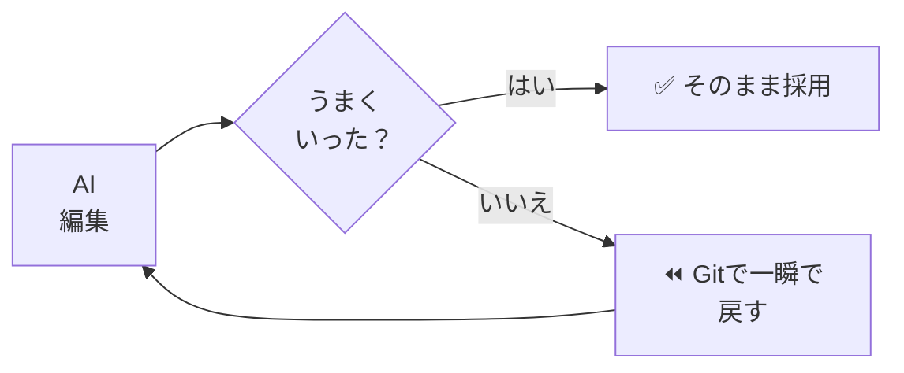
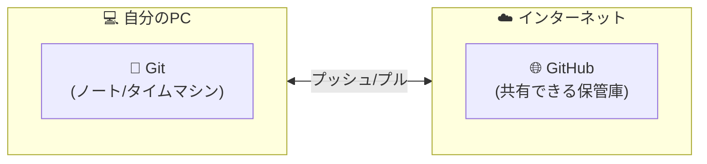
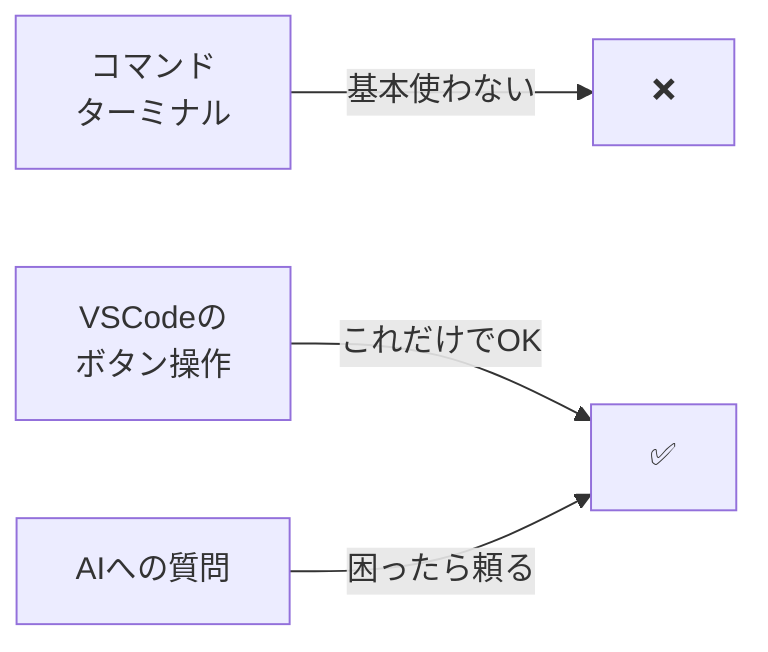

# 00: なぜGit/GitHubが必要か

> 🎯 **この章でできるようになること**: AI時代に Git / GitHub が「絶対必要」な理由を1分で説明できる
> ⏱ **想定所要時間**: 5分
> 🔑 **前提知識**: なし（このガイドの最初の章です）

---

## 😱 こんな経験ありませんか？

ChatGPTやClaude、GitHub Copilotに「こんな感じで作って」と伝えるだけで、Webサイトやアプリ、レポートが出来上がる時代になりました。
これがいわゆる **バイブコーディング**（コードの書き方を知らなくても、雰囲気をAIに伝えて作る手法）です。

ところが、ここに大きな落とし穴があります。

> **AIが書き換えた結果を見て「うーん、やっぱり前の方が良かったな」と思ったとき、元に戻せないことがあるのです。**

- `Ctrl + Z` を連打しても、AIが一気に書き換えた範囲は戻りきらない
- エディタを閉じてしまえば、もう完全にアウト
- 良い感じだったファイルが、二度と取り戻せない…

これ、本当に困りますよね？

---

## 🔑 答えはシンプル



**Git/GitHubを使えば、AIにファイル編集を任せても怖くなくなります。**

なぜなら、Gitはファイルの **「タイムマシン」** だからです。
いつ・誰が・何を変更したのか? すべての履歴が記録され、いつでも好きな時点の状態に戻せます。

- AIの提案がイマイチだった? → ワンクリックで元に戻せます
- 何度も修正を重ねて迷子になった? → 「あの時点」にいつでも帰れます

AIにファイルをぐちゃぐちゃにされる前に、バージョン管理（変更履歴の管理）を始めましょう。
そうすれば、AIにどんどん作業を任せられるようになります。

---

## 🗂 Git と GitHub のざっくりイメージ



| 項目 | Git | GitHub |
|------|-----|--------|
| 役割 | 自分のPC内で履歴を記録する **ツール** | 記録したデータをネット上で共有・管理する **サービス** |
| 場所 | あなたのPCの中（**ローカル**） | インターネット上（**クラウド**） |
| 主な用途 | 過去の状態に戻す、変更を記録 | チームで共有、AI機能、タスク管理 |

> 💡 Gitは「自分のPC内で履歴を記録するツール」、GitHubは「それを世界中（あるいはチーム内・個人）で共有・管理する場所」と覚えると分かりやすいです。

---

## 📓 Git ＝ 保存するたびにページが増えるノート

普通のファイル保存は「今の状態」だけを上書きします。
Gitは違います。**変更のたびに新しいページを追加** していきます。

- 3日前に書いた文章 → 残っている
- 昨日AIに修正させた内容 → 残っている
- さっき自分で直した部分 → もちろん残っている

「やっぱり3日前の状態に戻したい」と思ったら、そのページを開くだけ。
これがGitの「タイムマシン」と呼ばれる理由です。

---

## 🌐 GitHub ＝ ノートをネットに置ける共有スペース

Gitが「自分のPC内のノート」だとすると、GitHubは **「そのノートをネット上で安全に保管・共有できるサービス」** です。

「プログラマー版のGoogleドライブ」と表現されることもありますが、それ以上の存在です。

- 🔒 **バックアップ**: PCが壊れても、GitHubに保存しておけば安心
- 💼 **どこからでもアクセス**: 自宅PC・職場PC・ノートPC、どこでも同じ状態で再開
- 🤖 **AIとの連携**: GitHub Copilot等のAIアシスタントが、あなたのファイルを理解して手伝う

> 💡 個人利用でも、GitHubにプッシュ（アップロード）しておけば「安心のバックアップ + どこでも作業」が実現します。

GitHubは「**オープンソース**（誰でも中身を見られるソフトウェア）」の聖地でもあります。
世界中の優秀なエンジニアが公開した知恵を、あなたのAI開発に役立てられます。

---

## 🎁 Git/GitHubがAI時代にもたらす3つの価値

### ① 「恐れず試行錯誤」できる復元力
AIが思わぬ方向に変更しても、コミット（変更を保存した地点）に一瞬で戻れます。
**「絶対に戻れる」という安心感** が、AI時代の自由な創造性を支えます。

### ② プログラム以外も管理できる
Git/GitHubはプログラム専用ではありません。
**文章・テンプレ・プロンプト・マニュアル** など、あらゆるテキストの管理に効きます。

| 管理すべき資産 | 活用例 |
|-----------------|--------|
| AIプロンプト集 | 営業資料・データ分析用の指示文を体系化 |
| 業務テンプレート | 提案書・企画書のMarkdownを一元管理 |
| 自動化スクリプト | AIに作らせたExcel処理やレポート作成ツール |
| ドキュメント / Wiki | 業務マニュアル・ナレッジベース |
| ナレッジ | 自分の知見をため込み、AIに読み込ませる |

### ③ AIアシスタントとの相性が抜群
Claude Code・Codex・Cursorなどの **AIエージェント**（自律的に作業を進めるAI）は、ローカル（自分のPC）に保存しているファイルを直接参照します。
履歴が残っていれば「いつ・なぜ・誰が変えたか」も AI が理解できるので、引き継ぎや修正が劇的に楽になります。

---

## 🚦 このガイドで使わない/使うもの



このガイドでは、**マウス操作だけで完結** するようにしています。
詰まったら **AIに聞く** という選択肢も常に用意しています。

---

## ✅ チェックリスト

- [ ] AI時代になぜGit/GitHubが必要かを1分で説明できる
- [ ] Gitは「自分のPCのノート」、GitHubは「ネット上の共有スペース」と説明できる
- [ ] 「タイムマシン」というメタファーを覚えた
- [ ] このガイドはコマンドをほぼ使わないと理解した

---

## 💡 つまづきポイント

| よくある誤解 | 実際は |
|--------------|--------|
| 「GitとGitHubは同じもの」 | 別物。Git＝ツール、GitHub＝サービス |
| 「エンジニア専用ツール」 | 文章・資料・プロンプト管理にも使える |
| 「コマンドを覚えないとダメ」 | VSCodeのボタン操作でほぼ完結する |

---

## 🤖 AIへの質問テンプレ

最初の段階でAIに聞くなら、こんな聞き方が便利です。

```text
Git/GitHubをこれから始める非エンジニアです。
私の業務は[ 営業 / マーケ / 企画 など ]で、
[ 提案書 / プロンプト / Excel自動化 ]を管理したいです。
最初に何をすべきか、ステップごとに教えてください。
```

```text
バイブコーディングを始めたいのですが、
AIにファイルを壊される不安があります。
Git/GitHubでどう守ればいいか、初心者向けに教えてください。
```

---

## 🚀 次の章へ

なぜ必要かが分かったら、次は用語を図解で押さえます。

[➡ 01章「基本用語の図解解説」へ](./01-concepts.md)
