# 01: 基本用語の図解解説

> 🎯 **この章でできるようになること**: Git/GitHubの主要用語10個を図でイメージできる
> ⏱ **想定所要時間**: 15分
> 🔑 **前提知識**: [00章「なぜGit/GitHubが必要か」](./00-intro.md)

---

## 🗺 全体像（まずはこれだけ覚えればOK）

> 📎 この図は単独ファイル化されています: [`assets/diagrams/git-github-overview.md`](./assets/diagrams/git-github-overview.md)

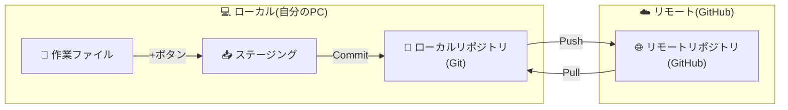

| 操作 | 何をする？ |
|------|------------|
| ステージング | 「次のセーブに含めるファイル」を選ぶ |
| コミット | ローカルのノートに「セーブ」する |
| プッシュ | ローカルの内容をGitHubに送る |
| プル | GitHubの最新を自分のPCに取り込む |

> 💡 最初から全部を暗記しなくても大丈夫です。作業のなかで何度か見ているうちに、自然に身につきます。

---

## 📦 リポジトリ（Repository）：プロジェクトの「箱」

[SCREENSHOT: 01-concepts-repository.png - リポジトリ概念図]

リポジトリは、プロジェクトに関するファイル一式と、変更の履歴をまとめて入れる **「箱」** です。

- 営業資料、配信台本、Webサイトの文章、AIの指示文（**プロンプト**: AIへの指示）集など
- プロジェクトごとに箱を分けると探しやすくなります

リポジトリは2つの場所に存在しえます。

| 種類 | 場所 |
|------|------|
| ローカルリポジトリ | 自分のPCの中（Gitが管理） |
| リモートリポジトリ | GitHub上 |

---

## 💾 コミット（Commit）：変更を確定する「セーブ」

[SCREENSHOT: 01-concepts-commit.png - コミット概念図]

コミットとは、ファイルの追加や修正を **履歴として記録する操作** です。
ゲームの「セーブポイント」に近いイメージです。

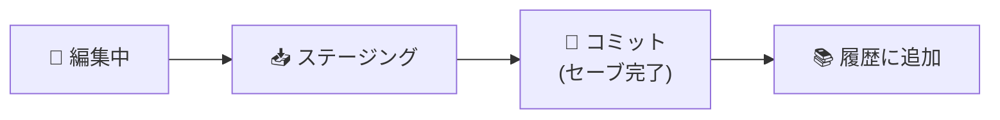

「何を・なぜ変えたか」というメッセージ（**コミットメッセージ**: セーブ時に添える一言メモ）と一緒に保存することで、後から履歴を追いやすくなります。

> ✏ **コミットメッセージの良い例 / 悪い例**
> ⭕ 「配信台本の導入を短くした」
> ⭕ 「営業資料の価格表を更新した」
> ❌ 「あ」
> ❌ 「2026/01/11 作業内容」

> ⚠ **コミットは基本的に「自分のパソコンの中」に残ります。**
> GitHub（ネット上）に反映するには、次に説明する **プッシュ** が必要です。

---

## ⬆️ プッシュ（Push）：ローカル → GitHub に送る

[SCREENSHOT: 01-concepts-push.png - プッシュ概念図]

プッシュは、自分のパソコン（ローカルリポジトリ）でセーブした変更（コミット）を、GitHub（リモートリポジトリ）に **反映する** 操作です。

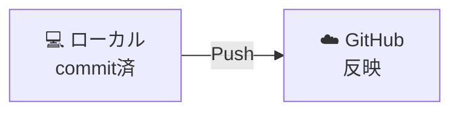

これにより、自分の作業内容を他のメンバーと共有したり、ノートPCなど他の環境でも同じリポジトリを参照できます。

---

## ⬇️ プル（Pull）：GitHub → ローカル に取り込む

[SCREENSHOT: 01-concepts-pull.png - プル概念図]

プルは、GitHub（ネット上）にある最新の変更を、自分のパソコン側に **反映する** 操作です。

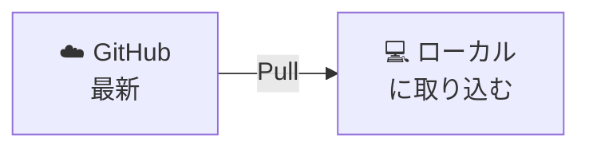

チーム作業では、作業を始める前や、誰かの変更を取り込みたいときに使います。

- 昨日、同僚が営業資料を直した → 今朝、自分も **プル** してから作業再開
- 昨日、ノートPCで作業して **プッシュ** した → 翌日、デスクトップ側で **プル** して引き継ぎ

> 💡 **プルとプッシュは反対方向。**
> プル ＝ ネット上 → 自分のPC
> プッシュ ＝ 自分のPC → ネット上

---

## 🌿 ブランチ（Branch）：同じ箱の中の「別レーン」

[SCREENSHOT: 01-concepts-branch.png - ブランチ概念図]

ブランチは、同じ箱の中で **作業場所を分ける** 仕組みです。
「いま公開中の内容」を崩さずに、別案を試したいときに使います。

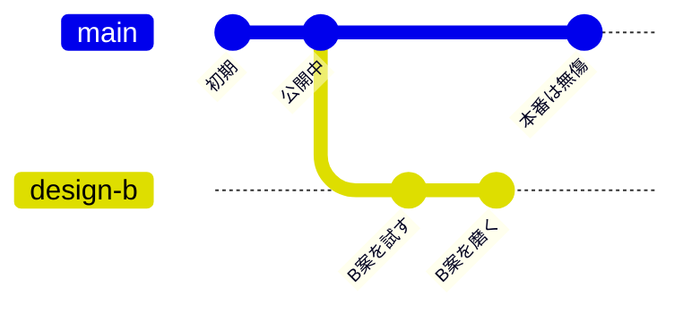

たとえば次のような場面です。

- 公開中のWebサイトはそのままに、裏で新しいデザイン案を試したい
- 台本のA案とB案を同時に作って、どちらが良いか見比べたい
- 本番環境をそのままに、新機能やバグ修正を試したい

> 💡 本番用のブランチは、多くのチームで **`main`（メイン）** という名前にしています。
> 新しくリポジトリを作った場合、最初は`main`ブランチのみが存在する状態です。

---

## 📨 プルリクエスト（Pull Request / PR）：本番に入れる前に「確認お願い」

[SCREENSHOT: 01-concepts-pr.png - プルリクエスト概念図]

プルリクエスト（略して **PR**）は、「この変更を本番側（多くの場合 `main` ブランチ）に入れていいですか?」と **確認をお願いする仕組み** です。

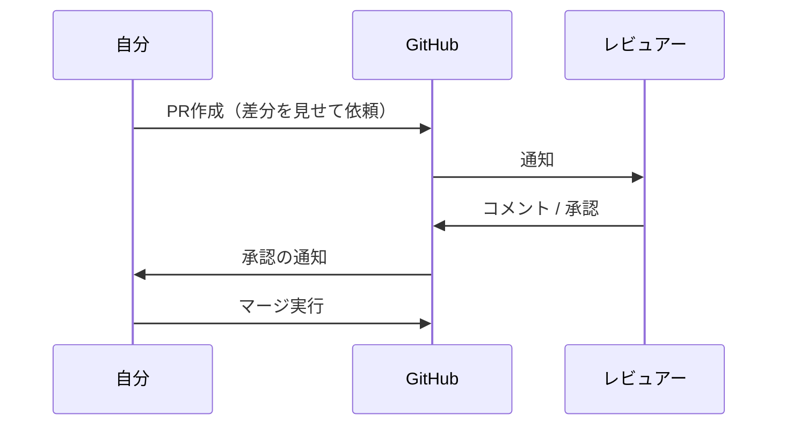

- 新機能を作った → 上司や他メンバーに修正内容を確認してもらう
- 規約の文章を直した → 担当者に内容を確認してもらう

> 💡 1人で作業している場合でも、PRを「公開前の最終チェック」として使うと安心です。
> 変更の差分（**Diff**: 変更前と変更後の比較）をGitHub上で確認できます。

---

## 🔀 マージ（Merge）：確認済みの変更を「本番に取り込む」

マージは、PRで確認した変更を、本番用のブランチ（多くは `main`）に **取り込む** 操作です。

| 用語 | 役割 |
|------|------|
| プルリクエスト | 「依頼」 |
| マージ | 「実行」 |

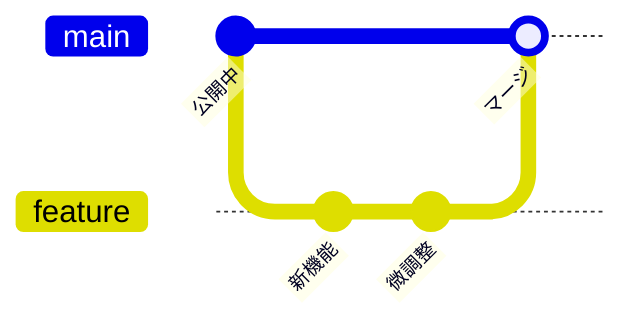

> ⚠ **マージコンフリクト（衝突）**
> 作業中に他の人が同じ箇所を書き換えてマージしていた場合、コンフリクトが発生します。
> どちらの変更を優先するか **手動で解消** しないとマージは完了しません。
> （困ったらAIに「コンフリクトを解消してほしい」と伝えればOK）

---

## 📋 イシュー（Issues）：課題やタスクの「掲示板」

[SCREENSHOT: 01-concepts-issue.png - Issues概念図]

Issues（イシュー）は、プロジェクトの **課題・タスク・バグ報告** を管理するための掲示板のような機能です。

Issueから直接ブランチを作ることができ、以下のメリットがあります。

| メリット | 内容 |
|----------|------|
| トレーサビリティ | Issueごとに `#123` の番号が振られ、ブランチ・PRから辿れる |
| 進捗の可視化 | 誰がどの課題を担当中か、チーム全体から一目瞭然 |
| 自動リンク | Issueから作ったブランチが自動で紐付く |
| 自動クローズ | PRをマージすると Issue が自動的に「完了」になる |
| 命名の簡略化 | Issueタイトルからブランチ名が自動生成される |

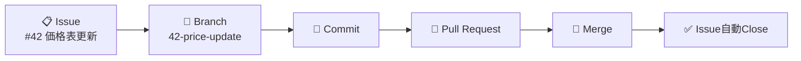

---

## 📥 クローン（Clone）：リポジトリを「自分のPCに持ってくる」

[SCREENSHOT: 01-concepts-clone.png - クローン概念図]

クローンは、リモートリポジトリ（GitHub上のプロジェクト）のファイルと履歴を、自分のローカルにそっくりコピーする操作です。

> 💡 「ダウンロードして終わり」ではなく、**あとでプル/プッシュで同期できる形** で持ってくるのがポイントです。

主な用途:
- チームのプロジェクトに参加する
- 別のPCで作業を続ける
- 公開されているテンプレートやサンプルを試す

---

## 🍴 フォーク（Fork）：他人のリポジトリを「自分のGitHubにコピー」

フォークは、他人のリポジトリを **自分のGitHubアカウント内にそっくりコピー** する機能です。

- 元の箱とは別物なので、自由に改造できます（元のリポジトリとのつながりは表示されます）
- 例: 公開されているテンプレート集をフォークして、社内用に書き換えて使う

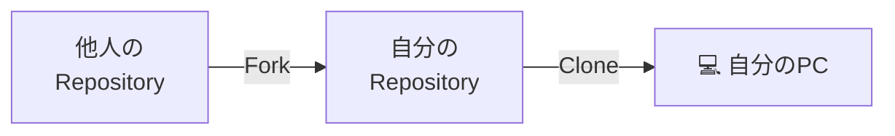

---

## 📊 用語の対応表

| 用語 | 日常業務でのイメージ | 役割 |
|------|----------------------|------|
| リポジトリ | プロジェクト用フォルダ（箱） | ファイルと変更の履歴をまとめる |
| コミット | こまめなセーブ＋一言メモ | 変更を記録して、あとで戻せる |
| プッシュ | 自分の変更を共有場所に送る | GitHubに反映して共有 |
| プル | 共有場所の最新版を取り込む | 他人の変更を自分の環境に反映 |
| ブランチ | A案/B案の同時進行（別レーン） | 本番を崩さず試す・分担作業 |
| プルリクエスト | 公開前の確認依頼（レビュー） | ミスを減らし、変更を見える化 |
| マージ | 確認済みの内容を本番に取り込む | 本番（最新版）を更新する |
| イシュー | 課題管理の掲示板 | 進捗の可視化・ブランチ自動作成 |
| クローン | 箱を自分のパソコンに持ってくる | 自分の環境で編集を始める |
| フォーク | 他人の箱を自分の箱としてコピー | テンプレを自分用に改造 |

---

## ♻️ 全体ライフサイクル（コミット→プッシュ→マージ）

> 📎 この図は単独ファイル化されています: [`assets/diagrams/lifecycle.md`](./assets/diagrams/lifecycle.md)

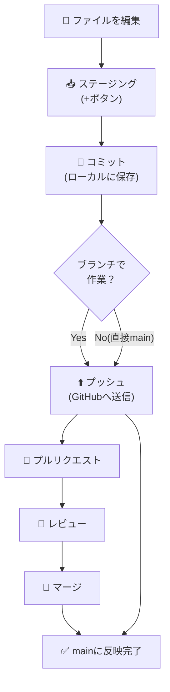

> 💡 個人開発なら最低限「コミット → プッシュ」だけで十分です。
> チームで使うときに「ブランチ → プルリクエスト → マージ」が活きてきます。

---

## 🔄 ファイルの状態遷移

> 📎 この図は単独ファイル化されています: [`assets/diagrams/file-state-transition.md`](./assets/diagrams/file-state-transition.md)

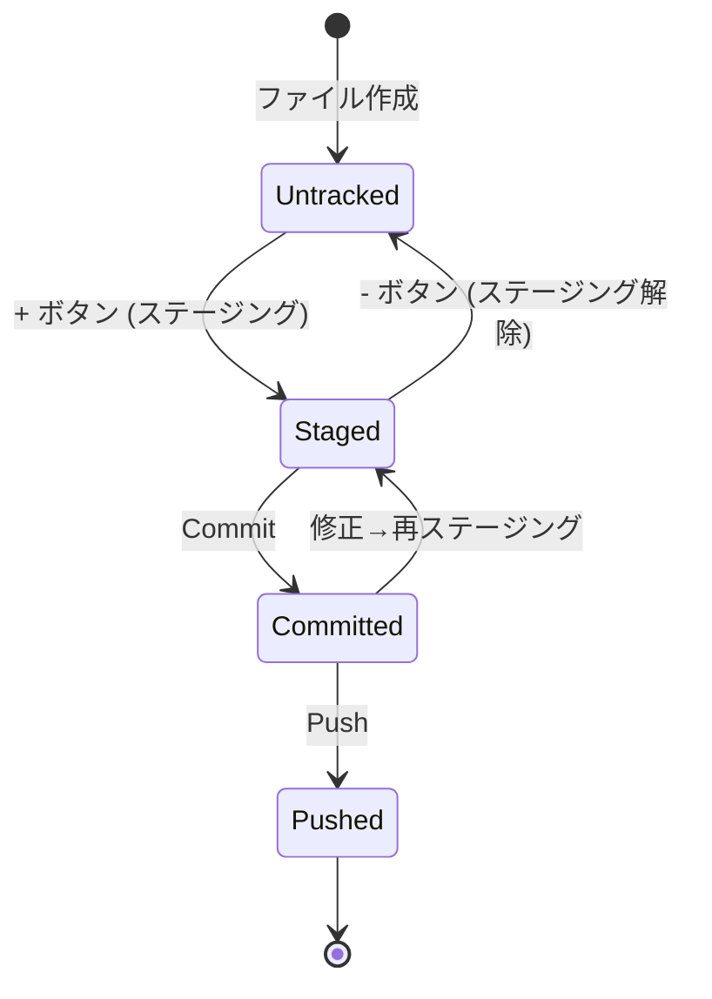

| 状態 | VSCodeでの見え方 |
|------|------------------|
| Untracked（追跡外） | Source Control の「Changes」に表示 |
| Staged（ステージ済） | 「Staged Changes」に表示 |
| Committed（セーブ済） | Graph に履歴として表示（ローカルのみ） |
| Pushed（共有済） | Graph に `origin/` 付きで表示 |

---

## ✅ チェックリスト

- [ ] リポジトリ／コミット／プッシュ／プルを言葉で説明できる
- [ ] ブランチ・プルリクエスト・マージの関係を図でイメージできる
- [ ] Issue から始めるとPRまで自動で連動することを理解した
- [ ] 「Untracked → Staged → Committed → Pushed」の流れを言える
- [ ] ローカルとリモートの違いを区別できる

---

## 💡 つまづきポイント

| よくある誤解 | 実際は |
|--------------|--------|
| 「コミットしたらGitHubに送られる」 | ローカルに保存されるだけ。**プッシュしないと共有されない** |
| 「ブランチを切ると別フォルダができる」 | 同じフォルダの中で「別レーン」として切り替わるだけ |
| 「PRとマージは同じ意味」 | PR＝依頼、マージ＝実行 |
| 「フォークとクローンは同じ」 | フォーク＝GitHub内でコピー、クローン＝GitHub→自分のPCにコピー |

---

## 🤖 AIへの質問テンプレ

```text
Gitの[ コミット / プッシュ / プル / ブランチ / マージ ]について、
非エンジニア向けに身近な例えで説明してください。
```

```text
今、自分のリポジトリで以下の状況です。
- ローカルでコミットを3つ作った
- まだGitHubにプッシュしていない
このとき、これらの変更はGitHub上に存在しますか？
存在しない場合、何をすれば共有できますか？
```

```text
プルリクエストとマージの違いを、
レビュー依頼書と承認印の比喩で説明してください。
```

---

## 🚀 次の章へ

用語が掴めたら、いよいよ環境構築です。

[➡ 02章「環境構築（VSCode/Git/GitHub）」へ](./02-setup.md)
