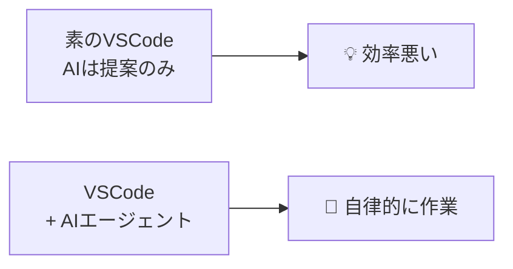
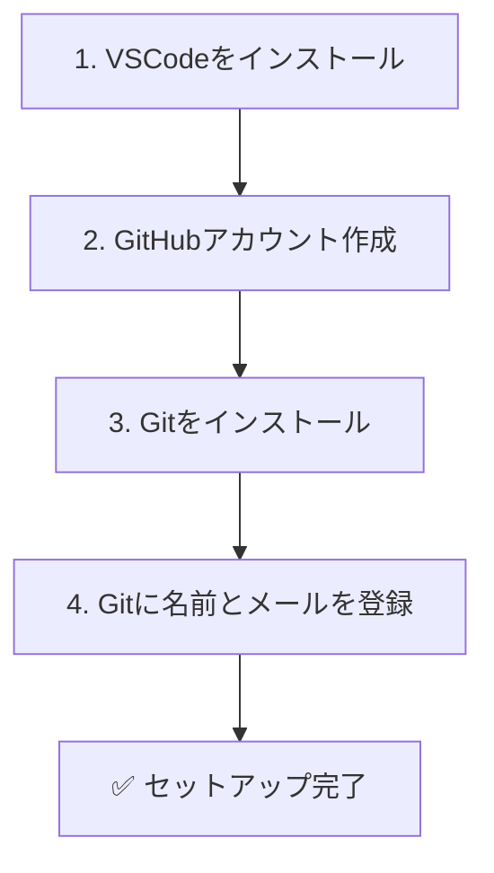

# 02: 環境構築（VSCode / Git / GitHub）

> 🎯 **この章でできるようになること**: VSCode・Git・GitHubアカウントを準備し、3つを連携した状態にできる
> ⏱ **想定所要時間**: 20分
> 🔑 **前提知識**: [01章「基本用語の図解解説」](./01-concepts.md)

---

## 🛠 これから揃える3点セット


| 役割 | ツール | 価格 |
|------|--------|------|
| 編集する場所 | **VSCode** | 無料 |
| 履歴を残す道具 | **Git** | 無料 |
| ネットの保管庫 | **GitHub** | 無料 |

> 💡 すべて無料で使えます。インストール手順はWindowsを想定しますが、Macでもほぼ同じです。

---

## 🤖 VSCodeとは？（30秒で要点）

[SCREENSHOT: 02-setup-vscode-logo.png - VS Codeロゴ]

**VS Code（Visual Studio Code）** は、一言で言えば **「AIと一緒に何でも書ける、超高性能なノート」** です。

非エンジニアにとってのVS Codeは、こんなツールです。

- 📝 **最強のメモ帳・執筆ツール**: 数千行のテキストも一瞬で開ける軽さ
- 🤖 **AIアシスタントの作業場**: メール返信案からExcelマクロまで、AIと対話しながら作業
- ⚡ **一括処理の魔法**: 「100ファイルの特定文字を全部置換」が数秒で終わる

> 💡 「プログラミングを学ぶため」ではなく、**「AIに動いてもらうためのコックピットを手に入れる」** という感覚で導入するのが、2026年流の使い方です。

---

## 🚀 これからは「素のVS Code」より「AIエージェント環境」



**AIエージェント**（自律的に作業を進めるAI）を組み合わせると、こんなことが起きます。

| 機能 | 内容 |
|------|------|
| 作業の自律化 | ファイル作成・テスト・デバッグ・コマンド実行までAIが自分で完了 |
| コンテキスト共有 | プロジェクト全体のファイルを読み、「あの部分直して」で通じる |
| エラー解消の自動化 | ターミナルのエラーを検知して、AIが修正→再実行 |

### 推奨1: VS Code × AIエージェント
| ツール | 特徴 |
|--------|------|
| **Claude Code** (CLI / 拡張機能) | 現状最強クラス。汎用タスクもこなせる。料金はかかるが費用対効果◎ |
| **Codex** (CLI / 拡張機能) | ChatGPT契約があれば追加契約不要。Claude Codeと並ぶ強力なエージェント |

> 💡 **CLI（黒い画面で動かすコマンド版）と VSCode拡張機能版の両方が用意されています。**
> ターミナル操作が苦手な方は **拡張機能版がおすすめ** です（詳しくは [06章](./06-advanced.md) で紹介）。

### 推奨2: 代替ツール（VS Code以外）
| ツール | 特徴 |
|--------|------|
| **Cursor** | VS Codeベースのエディタ。ペアプログラミング前提 |
| **Antigravity** | 完全にAI任せの体験を重視。**無料**。非エンジニアにおすすめ |

> 💡 **このガイドでは VSCode を中心に説明** しますが、Cursor / Antigravity でも操作はほぼ同じです。

---

## 🔗 VSCode × GitHub 連携のメリット

通常、Gitを使うにはこんなコマンドを覚える必要があります。

```bash
git add ファイル名
git commit -m "メッセージ"
git push リモート名 ブランチ名
```

これらを **一切覚えずに**、Excelを使う感覚でサクサク管理できるのがVSCode×GitHubの強みです。

[SCREENSHOT: 02-setup-vscode-github-merit.png - VSCode×GitHub連携のメリット]

| メリット | 内容 |
|----------|------|
| 🖱 直感的なGUI操作 | サイドバーの「Source Control」からボタン操作で完結 |
| 👁 視覚的な差分確認 | 変更箇所が色分けで表示。コミット前にDiffを直感的に確認 |
| ⚡ ワンクリック操作 | ステージング・コミット・プッシュ・プルが全部ボタン |
| 📨 PR/Issueをエディタで | 拡張機能 `GitHub Pull Requests and Issues` で完結 |
| 🔀 コンフリクト解消UI | 「現在の変更」「取り込む変更」を並べて選ぶだけ |

---

## 📋 セットアップの全体フロー



> 💡 順番に1つずつ進めれば30分以内に終わります。

---

## 1️⃣ VSCodeをインストール

[SCREENSHOT: 02-setup-vscode-download.png - VSCodeダウンロードページ]

1. [VSCode公式サイト](https://code.visualstudio.com/) を開く
2. 自分のOS用のインストーラーをダウンロード
3. インストーラーを起動し、基本は **「次へ」連打** でOK
4. インストール完了後、VSCodeが立ち上がればOK

> 💡 Cursor / Antigravity を使う方はこのステップをスキップして、各公式サイトからインストールしてください。

[SCREENSHOT: 02-setup-vscode-install-1.png - インストーラー起動画面]
[SCREENSHOT: 02-setup-vscode-install-2.png - インストール完了画面]

### おまけ: 日本語化したい場合
拡張機能から「Japanese Language Pack for Visual Studio Code」を入れると日本語化できます。
詳しい手順は **AI に聞くと一瞬** で教えてくれます。

---

## 2️⃣ GitHubアカウント作成

[SCREENSHOT: 02-setup-github-signup.png - GitHubサインアップ画面]

1. [GitHub](https://github.com/) を開く
2. 「Sign up」をクリック
3. メールアドレス・パスワード・ユーザー名を入力
4. （または）**Googleアカウントから作成**もOK

[SCREENSHOT: 02-setup-github-signup-2.png - アカウント作成完了画面]

ログインまでできたら準備完了です。

> 💡 ユーザー名は後でリポジトリのURL（`github.com/ユーザー名/リポジトリ名`）に入るので、シンプルなものがおすすめです。

---

## 3️⃣ Gitをインストール

[SCREENSHOT: 02-setup-git-download.png - Gitダウンロードページ]

### Windows
1. [Git for Windows](https://gitforwindows.org/) からインストーラーをダウンロード
2. インストーラーを開いて **基本はデフォルト設定** で「Next」連打
3. 最後に **「Launch Git Bash」にチェックを入れて Finish**

[SCREENSHOT: 02-setup-git-install-1.png - Gitインストーラー]
[SCREENSHOT: 02-setup-git-install-2.png - Launch Git Bashチェック]

> 💡 Git Bashを開き忘れたら、Windowsの検索窓で「git bash」と入力すれば見つかります。

### Mac

Macには **Xcode Command Line Tools** という公式ツール経由で簡単にGitを入れられます。インストーラーを別途ダウンロードする必要はありません。

1. **ターミナルを開く**: 画面右上の検索アイコン（虫眼鏡）をクリック → 「ターミナル」と入力 → Enter
2. **以下のコマンドを実行**:

   ```bash
   xcode-select --install
   ```

3. ポップアップが出るので **「インストール」** をクリック → 数分待つ
4. 完了後、ターミナルで以下を実行してバージョン番号が表示されればOK:

   ```bash
   git --version
   ```

> 💡 **すでにHomebrewが入っている方** は `brew install git` で最新版を入れる方が更新も楽です。
> Homebrewを知らない方は上記の `xcode-select --install` だけで問題ありません。

> ⚠ もしどちらの方法でも詰まったら、エラーメッセージを丸ごとコピーしてAIに相談してください。Macの環境差異は個別事情が多いので、AIに状況を伝える方が確実に早く解決します。

---

## 4️⃣ Gitに名前とメールを登録

Git Bash（またはMacのターミナル）を開き、以下を **1行ずつ** 実行します。

[SCREENSHOT: 02-setup-git-config-bash.png - Git Bash画面]

```bash
git config --global user.name "あなたの名前"
git config --global user.email "あなたのメール"
```

> ⚠ このガイドでコマンドを使うのは、ここを含めて **2〜3か所だけ** です。
> （ごめんなさい！ここだけ我慢してください。残りはすべてGUI操作で進められます）

| 項目 | 推奨 |
|------|------|
| 名前 | 自由でOK |
| メール | **GitHubアカウントで使ったものと同じ** にすると混乱しません |

### 確認

[SCREENSHOT: 02-setup-git-config-list.png - git config --list結果]

```bash
git config --list
```

出力の下のほうに `user.name` と `user.email` が設定通りに表示されていればOKです。

---

## 🌟 おまけ: VSCode拡張機能を入れておくと便利

| 拡張機能 | 何ができるか |
|----------|--------------|
| **GitHub Pull Requests and Issues** | VSCode内でPR作成・レビュー・Issue管理が完結 |
| **GitLens** | コードの上にカーソルを置くと「いつ・誰が・何を」変えたか表示 |
| **Git Graph** | ブランチの分岐・マージが路線図のように見える |
| **Claude Code / Codex（拡張機能版）** | CLIを使わずVSCode内のチャットUIでAIエージェントを動かす |

> 💡 06章でこれらの拡張機能はもう少し詳しく紹介します。
> **Git Graph は 05章「戻す系操作」で必須** なので、できれば今のうちに入れておきましょう。

---

## 📸 スクショの撮影について（参考）

このガイドのスクショは英語UIで撮影しています。
日本語化している場合、ボタン名は変わります（例: `Commit` → `コミット`）が、**配置は同じ** です。

---

## 🗺 VSCode画面ガイド（迷子防止マップ）

これ以降の章では「Source Control」「左下のmain」「右下の更新ボタン」「三点リーダー（︙）」などの **UI要素の場所** が頻繁に出てきます。
最初に **画面のどこに何があるか** を1枚で押さえておきましょう。

```
┌─────────────────────────────────────────────────────────────────────┐
│  File   Edit   View   Go   Run   Terminal   Help          ← トップメニュー
├──┬───────────────────────────────────┬──────────────────────────┤
│ A│                                   │  ⓒ Source Control パネル
│ B│          エディタ領域             │   ┌───────────────────┐
│ C│ (ファイルの中身を編集する場所)    │   │ コミットメッセージ │
│ D│                                   │   │   [ Commit ] [ ︙ ]  ← パネル上部の三点リーダー
│ E│                                   │   ├───────────────────┤
│  │                                   │   │ Changes        ＋ │  ← 一括ステージング
│  │                                   │   │   test.txt     ＋ │  ← 個別ステージング
│  │                                   │   ├───────────────────┤
│  │                                   │   │ Staged Changes    │
│  │                                   │   │   test.txt     ー │  ← ステージング解除
│  │                                   │   └───────────────────┘
│  │                                   │   [ Sync Changes ] ↕    ← Pull + Push
├──┴───────────────────────────────────┴──────────────────────────┤
│ ⎇ main  ☁/↕   ⚠0  ⓘ0       [F] Git Graph                          │
└─────────────────────────────────────────────────────────────────────┘
   ↑                                       ↑
  左下の「ブランチ名」                    右下の「Git Graph」ボタン
  クリックでブランチ切替                  (拡張機能インストール後)
```

### 左サイドバーのアイコン（A〜E）

| 記号 | アイコン | 名称 | 用途 |
|:----:|---------|------|------|
| **A** | 📄 重ねた紙 | Explorer | ファイル一覧 |
| **B** | 🔍 虫眼鏡 | Search | 全文検索 |
| **C** | 🌿 **Y字に分岐したアイコン** | **Source Control** | **★Gitの操作はすべてここ** |
| **D** | ▶ 三角＋虫 | Run and Debug | デバッグ実行 |
| **E** | 🧩 4つのブロック | Extensions | 拡張機能 |

> 💡 **C（Source Control）が本ガイドの主役です。**
> 「左サイドバーの **上から3番目**、**Y字に分岐したアイコン**」と覚えてください。

### よく出てくる場所の早見表

| 表現 | 場所 | 何をする？ |
|------|------|-----------|
| **Source Control** | 左サイドバーの **C**（Y字アイコン） | Gitの全操作の入口 |
| **左下の `main`** | ステータスバー左端 | 現在のブランチ名。クリックで切替 |
| **右下の更新ボタン**（↕ アイコン） | ステータスバー左下のブランチ名の隣 | Pull + Push（= Sync Changes） |
| **三点リーダー（︙）** | Source Control パネル **上部** | Push/Pull/Branch操作の詳細メニュー |
| **+ ボタン** | Source Control の Changes 行 / 各ファイル行 | ステージング |
| **- ボタン** | Source Control の Staged Changes 行 | ステージング解除 |
| **↩ ボタン** | Source Control の Changes 内ファイル行 | Discard Changes（破棄） |
| **Git Graph ボタン** | 右下のステータスバー（拡張機能導入後） | コミット履歴を路線図表示 |

> 💡 **「三点リーダー（︙）」は複数の場所に存在します。**
> 本ガイドで `︙` と書かれているときは、原則 **Source Control パネル上部** の三点リーダーを指します。
> CHANGES行などローカルな三点リーダーを使う場合はその都度明記します。

> 💡 **詰まったらこのセクションに戻ってきてください。**
> 03章以降で「Source Control を開いて」と書かれていたら、すぐに上の図を確認すれば迷いません。

---

## ✅ チェックリスト

- [ ] VSCodeを起動できる
- [ ] GitHubにログインできる
- [ ] Git Bash（またはターミナル）で `git --version` が通る
- [ ] `git config --list` に自分の名前とメールが出る
- [ ] GitHubのメールアドレスとGitに登録したメールアドレスが一致している

---

## 💡 つまづきポイント

| よくある問題 | 解決策 |
|--------------|--------|
| `git` コマンドが見つからない | Gitのインストールをやり直す。再起動も試す |
| GitHubアカウントが作れない | 別のメールで試す。GitHubのサポートに問い合わせる |
| 名前とメールを間違えて設定した | 同じコマンドをもう一度実行すれば上書きされる |
| Macで `git config` がエラー | ターミナルから実行（Git Bashは Windows 用） |

---

## 🤖 AIへの質問テンプレ

```text
Windows 11でGitをインストールしようとしています。
[ エラーメッセージ をそのまま貼る ]
というエラーが出ました。原因と解決方法を教えてください。
```

```text
Macを使っています。
Homebrewが入っていない状態でGitをインストールするには、
どの手順が一番安全ですか? ステップバイステップで教えてください。
```

```text
GitHubアカウントの作成で、ユーザー名のおすすめの付け方を教えてください。
個人利用ですが、後でフリーランス仕事にも使う可能性があります。
```

---

## 🚀 次の章へ

環境が整ったら、いよいよ最初のリポジトリを作ります。

[➡ 03章「初コミット〜Publish」へ](./03-first-commit.md)
