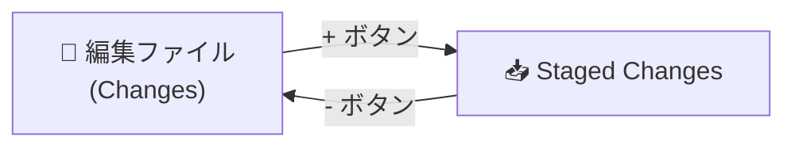
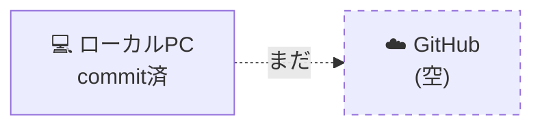
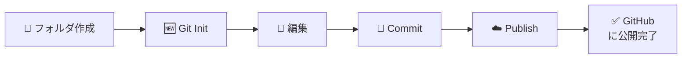

# 03: 初コミット〜Publish

> 🎯 **この章でできるようになること**: 自分のフォルダをGit管理にし、初めてのコミットをGitHubに公開できる
> ⏱ **想定所要時間**: 15分
> 🔑 **前提知識**: [02章「環境構築」](./02-setup.md) を完了していること

---

## 🗺 この章のゴール


---

## 📋 6ステップで完了

| # | ステップ | 所要時間 |
|---|----------|----------|
| 1 | VSCodeで作業フォルダを開く | 1分 |
| 2 | Gitを初期化する | 30秒 |
| 3 | ファイルを新規作成する | 1分 |
| 4 | ステージング＆コミットする | 2分 |
| 5 | GitHubにPublishする | 5分 |
| 6 | GitHub上で確認する | 1分 |

---

## 1️⃣ VSCodeで作業フォルダを開く

[SCREENSHOT: 03-first-commit-open-folder-1.png - VSCode起動画面]

1. VSCodeを開きます
2. 左サイドバーの **`Source Control` アイコン**（**Y字に分岐したアイコン、左サイドバーの上から3番目**）をクリック
3. **`Open Folder`** をクリック

> 💡 アイコンの位置が分からない方は [02章「VSCode画面ガイド」](./02-setup.md#-vscode画面ガイド迷子防止マップ) に戻って **C のアイコン** を確認してください。

[SCREENSHOT: 03-first-commit-open-folder-2.png - Open Folder画面]

4. テスト用に新しいフォルダを1つ作成し、それを選択
5. **`Select Folder`** をクリック

[SCREENSHOT: 03-first-commit-trust-folder.png - 信頼できるフォルダの確認]

> ⚠ **「信頼できるフォルダですか?」と聞かれたら**
> `Trust the authors of all files in the parent folder` にチェックを入れて、`Yes, I trust the authors` をクリック。

---

## 2️⃣ Gitを初期化する

[SCREENSHOT: 03-first-commit-initialize.png - Initialize Repositoryボタン]

**Source Control（Y字アイコン）** をもう一度クリックして開きます。
**`Initialize Repository`** というボタンが表示されているのでクリックします。

[SCREENSHOT: 03-first-commit-initialized.png - 初期化完了画面]

画面が切り替わり、**`Publish Branch`** というボタンが表示されたらOKです。

> 💡 **初期化（Initialize）はGitを使うための「おまじない」です。**
> 初めて開いたフォルダで Git を使う場合、毎回必ず最初に必要になります。
>
> 内部的には、フォルダ内に `.git` という隠しフォルダが作られ、そこに履歴が保存されていきます。

---

## 3️⃣ ファイルを新規作成する

[SCREENSHOT: 03-first-commit-new-file.png - 新規ファイル作成]

1. `Ctrl + N`（Macは `Cmd + N`）を押して新規ファイル作成
2. 内容は何でもOK。たとえば「テストです」と書く
3. `Ctrl + S`（Macは `Cmd + S`）で保存
4. ファイル名は何でもOK（例: `test.txt`）

---

## 4️⃣ ステージング＆コミット

### ステージング（次のセーブに含めるファイルを選ぶ）

[SCREENSHOT: 03-first-commit-staging.png - Source Controlのファイル一覧]

1. 左メニューから **Source Control** を開く
2. `Changes` の下に、先ほど作ったファイルが表示されている
3. ファイル名にマウスを乗せると、右側に **`+` ボタン** が出る



| 操作 | やり方 | 効果 |
|------|--------|------|
| 個別にステージング | ファイル横の `+` | そのファイルだけ次のセーブ対象に |
| 一括ステージング | Changes 横の `+` | 変更ファイル全部を対象に |
| ステージング解除 | Staged 内の `-` | 対象から外す |

[SCREENSHOT: 03-first-commit-staged.png - ステージング後の表示]

### コミット（セーブする）

入力ボックスに **コミットメッセージ**（一言メモ）を書き、**`Commit`** ボタンを押します。

> ✏ **良いコミットメッセージの例**
> ⭕ 「テストファイル追加」
> ⭕ 「README作成」

> 💡 **AIにコミットメッセージを考えてもらえます**
> ステージング後、コミットメッセージ入力欄の右にある **キラキラアイコン** を押すと、AIが変更内容から自動でメッセージを生成してくれます。

[SCREENSHOT: 03-first-commit-ai-message.png - AIメッセージ生成ボタン]
[SCREENSHOT: 03-first-commit-graph.png - GRAPHにコミット表示]

コミットすると、画面下の **`GRAPH`** にコミット履歴が表示されます。

---

## 🛑 ここまではローカルだけ



> ⚠ コミットはまだ **自分のローカルPC上にあるだけ** です。
> ノートPCで同じリポジトリを使ったり、他人に共有することはまだできません。
>
> ここで **GitHub** の出番です。

---

## 5️⃣ GitHubにPublish（公開・初回送信）

[SCREENSHOT: 03-first-commit-publish-button.png - Publish Branchボタン]

画面上部の **`Publish Branch`** をクリックします。

[SCREENSHOT: 03-first-commit-github-signin.png - GitHubサインイン]

1. 「GitHubにサインインして使いますか?」と表示が出る → **`Allow`** をクリック
2. ブラウザが開き、認証画面が表示される → **`Continue`** をクリック

[SCREENSHOT: 03-first-commit-authorize-vscode.png - VSCode認証画面]

3. **`Authorize Visual-Studio-Code`** をクリック

[SCREENSHOT: 03-first-commit-back-to-vscode.png - VSCodeに戻る確認]

4. ブラウザに「VSCodeを開きますか?」と出るので、チェックを入れて開く

[SCREENSHOT: 03-first-commit-public-private.png - Public/Private選択]

### Private と Public の選択

画面上部に **「Publish to GitHub private repository」** または **「public repository」** の選択肢が出ます。

| 種類 | 説明 | おすすめ |
|------|------|----------|
| **Private** | 自分だけが見られる | **基本こっち** |
| **Public** | 誰でも見られる。Clone/Forkも可能 | 公開したい場合のみ |

> ⚠ 機密情報を含む可能性があるなら、**必ずPrivate** を選びましょう。

### Git認証（追加でもう一段階）

[SCREENSHOT: 03-first-commit-git-auth-modal.png - Git認証モーダル]

`Sign in with your browser` をクリック → ブラウザで `Authorize git-ecosystem` をクリックして認証。

[SCREENSHOT: 03-first-commit-published.png - 認証成功メッセージ]

VSCode右下に **`Successfully published~`** と表示されればOKです。

> 💡 **認証方式について**
> 今回は手軽な **HTTPS方式** を使いました。
> より強固な **SSH方式** もありますが、HTTPSで問題なく使えます。
> 興味があれば「GitHubのSSH認証の設定方法」をAIに聞いてみてください。

---

## 6️⃣ GitHub上で確認

[SCREENSHOT: 03-first-commit-open-on-github.png - Open on GitHub]

VSCodeから **`Open on GitHub`** を開いてみましょう。

[SCREENSHOT: 03-first-commit-github-repo.png - GitHubリポジトリ画面]

ブラウザでGitHubのリポジトリ画面が開き、自分のアカウント配下にリポジトリができていれば成功です。
先ほど作成したファイルもちゃんと存在しているはずです。

[SCREENSHOT: 03-first-commit-repos-list.png - Repositories一覧]

右上のアイコン → **`Repositories`** で、自分が持っているリポジトリ一覧を確認できます。

---

## 🎉 おめでとうございます！

ここまでで、**「ローカルでセーブ → GitHubに公開」** の一連の流れが体験できました。



> 💡 **次回以降の流れはとてもシンプルです:**
> ローカルで編集 → コミット → **プッシュ**（次章で説明）

Publish は「初回の公開」専用のボタンで、2回目以降は **プッシュ** という操作で変更を送ります。
（GitHubに公開済みのリポジトリには Publish ボタンは表示されなくなります）

---

## 🔁 はじめてリポジトリを作る流れまとめ

1. 自分のPC上にフォルダを作る
2. VSCodeでそのフォルダを開く
3. Gitを **Initialize**（初期化）する
4. 変更内容をSource Controlからステージングし、**Commit**
5. **Publish** してGitHubに公開する

GitHubにパブリッシュ後は、ローカルで編集 → コミット → プッシュ を繰り返すだけです。

---

## ✅ チェックリスト

- [ ] VSCodeでフォルダを開いた
- [ ] `Initialize Repository` でGit管理を始めた
- [ ] 1つ以上のファイルを作成した
- [ ] ステージングしてコミットできた
- [ ] GitHubにPublishした
- [ ] ブラウザでGitHubのリポジトリページが開けた

---

## 💡 つまづきポイント

| よくあるトラブル | 解決策 |
|------------------|--------|
| `Initialize Repository` ボタンが出ない | フォルダを開き直す。VSCodeを再起動 |
| ステージングしても `Commit` が押せない | コミットメッセージを入力してから押す |
| Publishのとき認証画面が出ない | ブラウザのポップアップブロックを解除 |
| 「Author identity unknown」エラー | 02章の `git config` をやり直す |
| Publishはしたけどリポジトリが見つからない | GitHubのトップ右上アイコン → `Your repositories` |

---

## 🤖 AIへの質問テンプレ

```text
VSCodeで `Initialize Repository` を押したのですが、
コミットができません。エラーメッセージは出ていません。
原因として考えられるものを順番に教えてください。
```

```text
Publish Branchを押したら、こんなエラーが出ました。
[ エラーをそのまま貼る ]
原因と、初心者でもできる解決手順を教えてください。
```

```text
PublishでPrivateを選びました。
これを後からPublicに変更するにはどうすればいいですか?
```

---

## 🚀 次の章へ

初コミットができたら、次は日常的な使い方（プッシュ・ブランチ・PR・マージ）を学びます。

[➡ 04章「日常操作（Push/Branch/PR/Merge）」へ](./04-daily-workflow.md)
