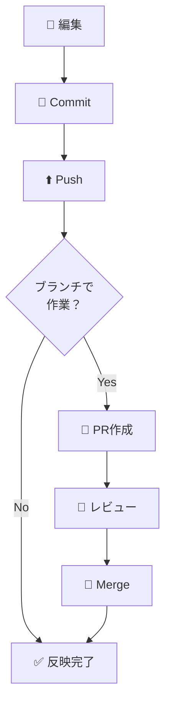
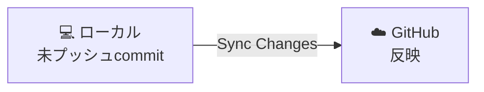
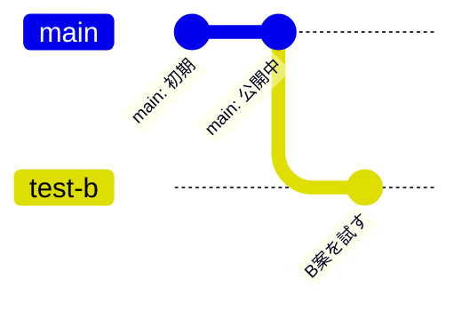
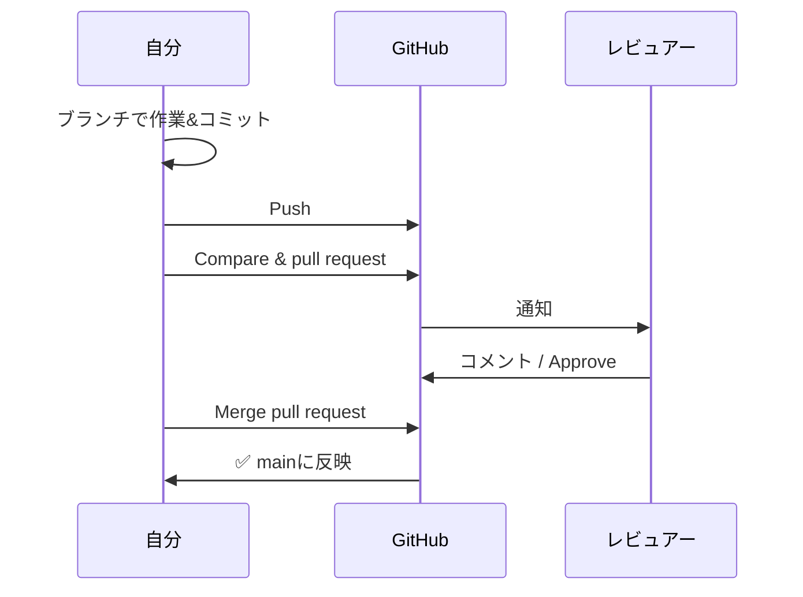
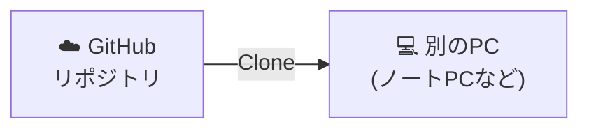
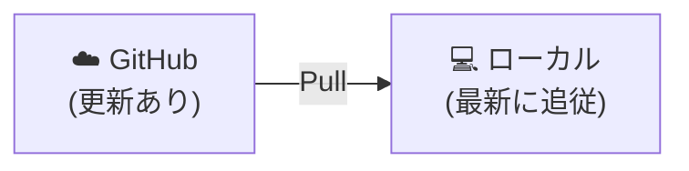
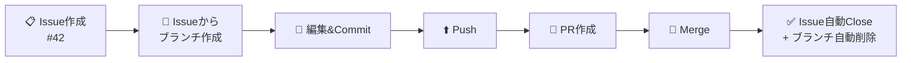

# 04: 日常操作（Push / Branch / PR / Merge）

> 🎯 **この章でできるようになること**: 毎日の作業に必要なPush・ブランチ作成・PR作成・マージ・Clone・Pull・Issue連携ができる
> ⏱ **想定所要時間**: 25分
> 🔑 **前提知識**: [03章「初コミット〜Publish」](./03-first-commit.md) を完了していること

---

## 🗺 この章で覚える日常フロー



> 💡 個人開発なら最低限「Push」だけ覚えればOK。
> チーム開発や自分自身のレビューには「Branch → PR → Merge」が活きます。

---

## 1️⃣ ファイルを追加してPushする

### ファイル追加 → コミット

[SCREENSHOT: 04-daily-add-file.png - 新規ファイル作成]
[SCREENSHOT: 04-daily-stage-commit.png - ステージング＆コミット]

03章と同じ手順です。

1. `Ctrl + N` で新規ファイル作成 → `Ctrl + S` で保存
2. Source Control → ステージング（`+` ボタン）
3. コミットメッセージを入力 → `Commit`

> 💡 コミットだけでは **GitHubにはまだ反映されません**。

### Sync Changes でプッシュ

[SCREENSHOT: 04-daily-sync-changes.png - Sync Changesボタン]

Source Control の **`Sync Changes`** ボタンを押します。



> 💡 **`Sync Changes` は厳密には「同期」操作です。**
> 内部的には **Pull（取得）→ Push（送信）** を一度に行います。
> リモートに新しい変更があれば先に取り込んでからプッシュしてくれるので、初心者にはこちらが安全。
>
> Pushだけ純粋にしたい場合は、Source Control パネルの **上部にある三点リーダー（︙）→ Push** を選べます（コミットメッセージ入力欄の右隣にあるボタンです）。

[SCREENSHOT: 04-daily-graph-after-push.png - Push後のGraph表示]

### Graphでローカルとリモートの状態を見る

| 表示 | 意味 |
|------|------|
| 🔵 青いアイコン | **ローカル** の最新コミット |
| 🟣 紫の雲アイコン (`origin/`) | **リモート（GitHub）** の最新コミット |

プッシュ前は 🔵 が 🟣 より進んでいます（ローカルだけにコミットがある状態）。
プッシュ後は **両方が同じ位置** に揃います。

> 💡 **`origin/` は「リモート追跡ブランチ」**
> ローカルに保存された **「GitHubの状態のコピー」** で、`fetch` や `pull` を実行した時点の状態を反映しています。
> 誰かがGitHub上で変更しても、`fetch / pull` するまでは `origin/main` は更新されません。

[SCREENSHOT: 04-daily-github-updated.png - GitHubに反映]

GitHubの画面を更新すれば、新しいファイルが反映されているのが見えます。

---

## 2️⃣ ブランチ（Branch）を作成する



### VSCodeでブランチ作成

[SCREENSHOT: 04-daily-branch-click.png - 左下mainクリック]

1. VSCode左下の **`main`** と書かれている場所をクリック
2. 上部に既存ブランチの一覧 + **`+ Create new branch`** が表示される

[SCREENSHOT: 04-daily-branch-create.png - + Create new branchをクリック]

3. `+ Create new branch` をクリック
4. ブランチ名を入力（例: `test-b`）→ Enter

[SCREENSHOT: 04-daily-branch-created.png - 左下の表示が切り替わる]

左下の表示が新ブランチ名に切り替わったら作成完了です。

> ⚠ **この時点ではローカルにしか存在しません。**
> 左下のブランチ名の横に **雲のアイコン** が表示されているはずです。
> これは「GitHubにまだない」サインです。

### ブランチをGitHubにPublish

[SCREENSHOT: 04-daily-publish-branch.png - Publish Branchボタン]

Source Control から **`Publish Branch`** をクリック。

[SCREENSHOT: 04-daily-published.png - 雲アイコンが消える]

雲アイコンが消えたら、GitHubにもブランチが作成されました。

[SCREENSHOT: 04-daily-github-branch-list.png - GitHub上のブランチ一覧]

GitHub上で `main` 横のドロップダウンを開けば、新しいブランチが見えます。

### ブランチを切り替える

左下のブランチ名をクリックすれば、一覧から選んで切り替えられます。

> ⚠ **未コミットの変更があると切り替えできません**
> 以下のいずれかが必要です:
> - 変更を全部コミットする
> - 変更を全部破棄する
> - **stash**（一時退避）する ← 詳細はAIに聞いてください

---

## 3️⃣ プルリクエスト（Pull Request）を作る

### 流れ



### 手順

[SCREENSHOT: 04-daily-pr-add-file.png - ブランチ上で新ファイル作成]

1. 作成したブランチ上で、ファイルを編集してコミット → プッシュ
2. GitHubで対象のリポジトリを開き、ブランチを切り替えて差分を確認

[SCREENSHOT: 04-daily-compare-pr.png - Compare & pull requestボタン]

3. 上部に **`Compare & pull request`** ボタンが表示される → クリック

[SCREENSHOT: 04-daily-pr-create-screen.png - PR作成画面]

4. PR作成画面が開く。左右に差分が表示されている
5. タイトルと説明を書いて **`Create pull request`**

[SCREENSHOT: 04-daily-pr-created.png - PR作成完了]

PRが作成されました。

[SCREENSHOT: 04-daily-pr-commits-tab.png - Commitsタブ]

`Commits` タブを開けば、このブランチのコミット履歴がすべて見られます。

> 💡 **個人利用のとき**
> 自分1人でも、PRを「公開前の最終チェック」として使うのがおすすめです。
> 差分を冷静に見直すと、思わぬミスに気付けます。

---

## 4️⃣ マージ（Merge）する

[SCREENSHOT: 04-daily-merge-button.png - Merge pull requestボタン]

PR画面で **`Merge pull request`** をクリック。

[SCREENSHOT: 04-daily-confirm-merge.png - Confirm merge画面]

コミットメッセージを確認し、**`Confirm merge`** をクリックでマージ完了です。

[SCREENSHOT: 04-daily-merged.png - マージ完了画面]

`main` ブランチに切り替えて、変更が反映されているか確認しましょう。

> 💡 **リポジトリの権限について**
> 個人リポジトリは、PR作成・レビュー・マージを全部自分でできます。
> チーム開発では、**書き込み権限以上を持つ人** だけがマージできます。

### 不要ブランチの削除

マージ後の作業ブランチは基本的に不要です。

[SCREENSHOT: 04-daily-delete-branch-github.png - GitHubでブランチ削除]

GitHubのブランチ一覧から削除できます（リモートのみ）。

[SCREENSHOT: 04-daily-delete-branch-vscode.png - VSCodeでローカルブランチ削除]

VSCodeでは Source Control パネル **上部の三点リーダー（︙）** → **Branch** → **Delete Branch / Delete Remote Branch** で削除できます。

> 💡 ここで使う `︙` は **パネル最上部にあるもの**（コミットメッセージ入力欄の右隣）です。
> 各ファイル行や `Changes` 見出し行にも別の `︙` が出ることがありますが、ブランチ操作はパネル最上部のものを使います。

---

## 5️⃣ クローン（Clone）：別の環境に持ってくる



別のPCで同じリポジトリで作業したいときに使います。

### 手順

[SCREENSHOT: 04-daily-clone-copy-url.png - GitHubでURL取得]

1. GitHubで対象リポジトリを開き、**`Code`** ボタンをクリック
2. **HTTPS** タブを選び、URLをコピー

[SCREENSHOT: 04-daily-clone-new-window.png - VSCodeで新規ウィンドウ]

3. VSCodeで `File → New Window`（新規ウィンドウ）を開く
4. `Ctrl + Shift + P` で **コマンドパレット** を開く

> 💡 **コマンドパレットとは**
> VSCodeのほぼ全機能にキーボードからアクセスできる強力な検索ボックスです。
> コマンド名やキーワードを入力して素早く操作（ファイル検索・設定変更・拡張機能管理など）できます。

[SCREENSHOT: 04-daily-clone-command.png - Git: Cloneコマンド]

5. `clone` と入力 → **`Git: Clone`** を選択
6. コピーしたURLを貼り付けてEnter

[SCREENSHOT: 04-daily-clone-destination.png - 保存先選択]

7. 保存先フォルダを選び **`Select as Repository Destination`**

[SCREENSHOT: 04-daily-clone-open.png - リポジトリを開くか確認]

8. 「クローンしたリポジトリを開きますか?」 → **`Open`**

[SCREENSHOT: 04-daily-clone-done.png - 開けた状態]

これで別環境にリポジトリを持ってこれました。

> 💡 公開リポジトリならどれでもクローンできます。
> 世界中のテンプレ・サンプル・AI関連リポジトリを自由に試せるのは、GitHubの大きな魅力です。

---

## 6️⃣ プル（Pull）：最新状態を取り込む



別のPCで作業した内容や、チームメンバーの変更を取り込むときに使います。

### 手順（試しに差分を作って取り込む）

[SCREENSHOT: 04-daily-pull-add-readme.png - GitHub上でREADME作成]

1. GitHubのリポジトリ画面で **`Add a README`** をクリック

> 📘 **READMEとは?**
> リポジトリのトップページに表示される **「プロジェクトの説明書」** です。
> 一般的に以下を書きます:
> - 概要: 何のためのプロジェクトか
> - インストール方法
> - 使い方
> - 必要環境
> - ライセンス
>
> 完成度を高めたいときは、リポジトリ全体を **AIに読み込ませて書いてもらう** と楽です。

2. 適当な内容を書いて **`Commit changes`** → 確認画面で再度 **`Commit changes`**

[SCREENSHOT: 04-daily-pull-readme-created.png - README追加完了]

GitHub上にだけ `README.md` が存在する状態になりました。

[SCREENSHOT: 04-daily-pull-button.png - VSCode右下の更新ボタン]

3. VSCodeを開き、右下の **更新ボタン（同期アイコン）** をクリック

これで `origin/main` から最新を取得（プル）し、ローカルに `README.md` が追加されます。

> 💡 **更新ボタンは「Pull + Push」を兼ねています。**
> ローカルに未プッシュコミットがあれば、Pull後にPushまで一気に実行されます。

---

## 7️⃣ Issue（イシュー）を立てて連携する



### Issue作成

[SCREENSHOT: 04-daily-issue-new.png - GitHub Issuesタブ]

1. GitHubのリポジトリで上部の **`Issues`** タブ → **`New issue`**
2. タイトルと概要を入れて **`Create`**

[SCREENSHOT: 04-daily-issue-created.png - Issue作成完了]

Issueには `#2` のように **連番の番号** が振られます。

### Issueからブランチを作成

[SCREENSHOT: 04-daily-issue-create-branch.png - Create a branch]

1. Issue画面右側の **Development** にある **`Create a branch`** をクリック

[SCREENSHOT: 04-daily-issue-branch-name.png - ブランチ名確認]

2. ブランチ名はそのままでOK（Issue名 + Issue番号で自動生成）
3. **`Create branch`** をクリック

> 💡 これで、Issue とブランチが自動で紐付きます。

### ローカルに最新情報を取得（fetch）

[SCREENSHOT: 04-daily-fetch-terminal.png - VSCodeターミナル]

VSCodeでターミナルを開きます（メニューの `Terminal → New Terminal` または `Ctrl + ~`）。

```bash
git fetch
```

> ⚠ ここでまた1つだけコマンドを使ってしまいごめんなさい。
> （VSCodeの 同期 / Pull ボタンで代用しても大丈夫です）

`git fetch` は、リモートの最新情報（コミット・ブランチ・タグ）を **ローカルにダウンロード** するコマンドです。
これで先ほどGitHubで作ったブランチがVSCodeから見えるようになります。

### ブランチ切り替え → 作業 → Push

[SCREENSHOT: 04-daily-issue-switch-branch.png - リモートブランチ選択]

1. 左下の `main` をクリック → 一覧から `origin/2-d1` のようなブランチを選択

> ✅ **`origin/` で始まるリモートブランチを選ぶと、「ローカル追跡ブランチを作成しますか?」と聞かれることがあります。**
> **「作成」を選べばOKです。これだけで99%のトラブルは回避できます。**
>
> 万が一「作成しない」を選んでしまうと **detached HEAD** という特殊な状態になりますが、慌てる必要はありません。
> AIに「detached HEAD から戻したい」と相談すれば数ステップで復旧できます。

2. ファイルを編集してコミット
3. **左下の更新ボタン** または `Sync Changes` でプッシュ

[SCREENSHOT: 04-daily-issue-pr.png - GitHubでPR表示]

GitHubを開くと、**プッシュしたブランチのPR提案** が表示されているはずです。

### PR → Merge → 自動クローズ

[SCREENSHOT: 04-daily-issue-merged.png - マージ完了]

PRを作成 → `Merge pull request` → `Confirm merge` でマージ完了。

[SCREENSHOT: 04-daily-issue-closed.png - Issue自動クローズ]

Issuesタブを見ると、そのIssueは消えています。
入力ボックスの `state:open` を削除すると、解決済（`Closed`）も含めて表示されます。

> 💡 **Issueから作ったブランチは、PRをマージすると自動で削除されます。**
> 後片付けまで自動でやってくれて便利。

---

## 📊 ボタン操作早見表

| やりたいこと | VSCodeでの場所 | 効果 |
|--------------|----------------|------|
| ステージング | Source Control の `+` | 次のコミットに含める |
| コミット | Source Control の `Commit` | ローカルに保存 |
| Sync Changes（同期） | Source Control の `Sync Changes` ／ 右下の更新ボタン | Pull + Push（どちらも同じ動作） |
| Push のみ | Source Control の `︙` → Push | ローカル → GitHub |
| Pull のみ | Source Control の `︙` → Pull | GitHub → ローカル |
| ブランチ作成 | 左下の `main` をクリック | 別レーンで作業 |
| Publish Branch | Source Control 上部のボタン | 新ブランチをGitHubに送る |

> 💡 **`Sync Changes` ボタンと右下の更新ボタンは同じ機能（Pull + Push）です。**
> どちらを押してもOK。「Pullだけ」「Pushだけ」を厳密に分けたい場合のみ三点リーダー（︙）から選びます。

---

## ✅ チェックリスト

- [ ] ファイル追加 → コミット → プッシュ までを単独でできる
- [ ] ブランチを作成・GitHubにPublishできる
- [ ] PRを作成 → Merge までを体験した
- [ ] Cloneで別フォルダにリポジトリを持ってこられた
- [ ] Pullで最新の変更を取り込めた
- [ ] Issueから始めて、PRマージで自動クローズまで体験した

---

## 💡 つまづきポイント

| 状況 | 解決策 |
|------|--------|
| Sync Changes を押しても何も起きない | コミットが0件。先にコミットしてからSync |
| ブランチを切り替えられない | 未コミットの変更がある。コミットor破棄してから |
| PRボタンが見つからない | リポジトリを開き直し、`Compare & pull request` バナーを探す |
| `origin/...` を選んだら detached HEAD になった | 「ローカル追跡ブランチを作成」を選び直す。AIに相談 |
| Cloneで保存先が分からない | 普段の作業フォルダ内に新しいフォルダを作ってそこに保存 |
| Issue連携でブランチがVSCodeで見えない | `git fetch` を実行する。または更新ボタンを押す |

---

## 🤖 AIへの質問テンプレ

```text
PRを作成してマージしたあとに、ローカルブランチも削除したいです。
VSCodeのGUI操作だけで完結する手順を教えてください。
```

```text
Sync Changes を押したらこのエラーが出ました。
[ エラーメッセージ ]
原因と、初心者でも安全な解決手順をステップバイステップで教えてください。
```

```text
ブランチを切り替えたいのですが「未コミットの変更があります」
と言われて切り替えできません。
今の変更を消したくない場合の選択肢を全部教えてください。
```

```text
チームで使うとき、PRはどんなタイトルで書くと良いですか？
営業資料管理リポジトリ（非エンジニア向け）の例を5つ作ってください。
```

---

## 🚀 次の章へ

日常操作ができるようになったら、次は「失敗したときに戻す」操作です。

[➡ 05章「戻す系操作（Discard / Revert / Undo）」へ](./05-recovery.md)
