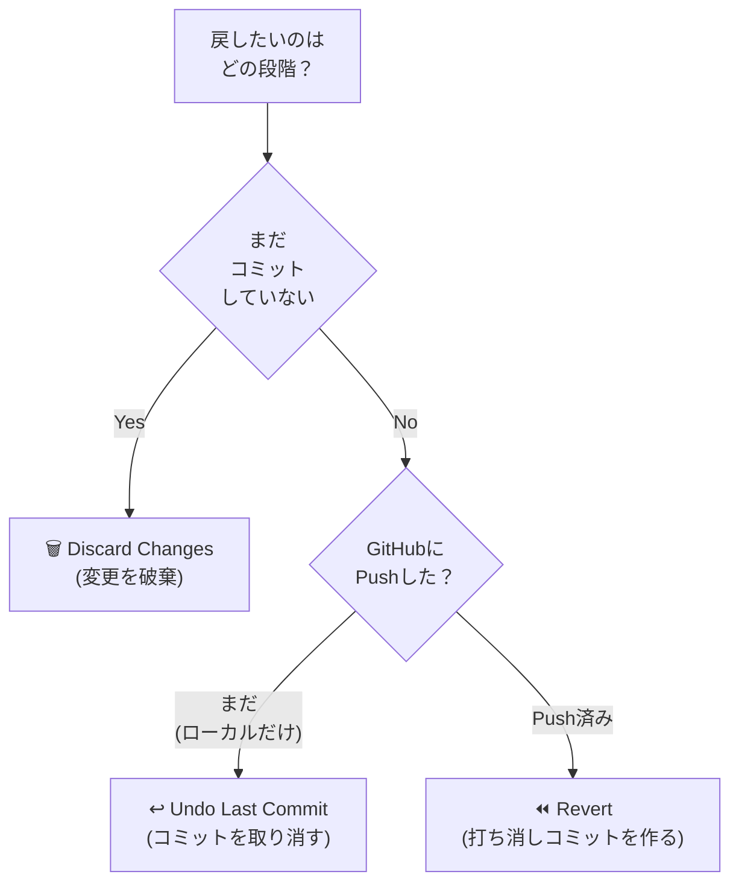
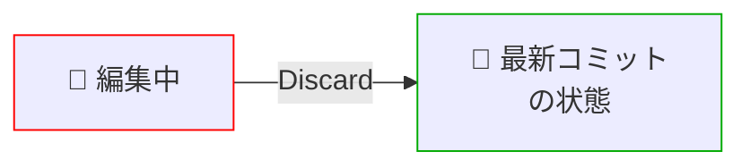
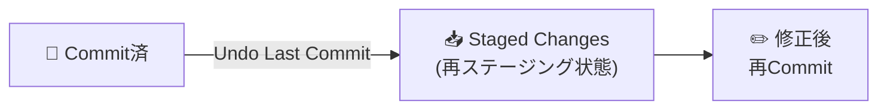
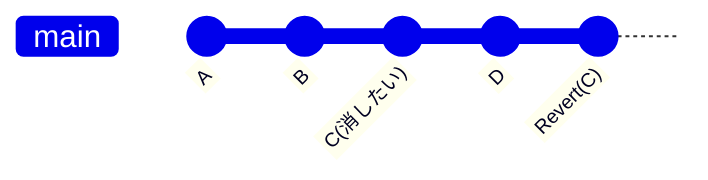
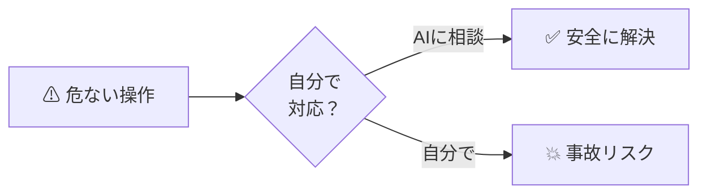

# 05: 戻す系操作（Discard / Revert / Undo）

> 🎯 **この章でできるようになること**: 「やっぱり戻したい」を3つの方法で安全に対処できる
> ⏱ **想定所要時間**: 15分
> 🔑 **前提知識**: [04章「日常操作」](./04-daily-workflow.md) を完了していること

---

## 😱 こんなときに使います

- 「AIが書き換えたの、やっぱり前の方がよかった…」
- 「コミットしちゃったけど、この変更なかったことにしたい」
- 「Revert用のコミット作っちゃったけど、それも要らない」

> 💡 **どの状況でも、Gitなら戻せます。**
> 大事なのは「どの段階で戻したいか」を見極めて適切な操作を選ぶこと。

---

## 🗺 戻す方法の選び方（フローチャート）



| 段階 | 推奨操作 | 何をする？ |
|------|----------|------------|
| ① 編集中（未コミット） | **Discard Changes** | 編集を捨てて最新コミットの状態に戻す |
| ② コミット済み（未Push） | **Undo Last Commit** | 最後のコミットだけを取り消す |
| ③ Push済み | **Revert** | 打ち消し用の新しいコミットを作る |

---

## 1️⃣ Discard Changes：編集をなかったことにする（未コミット）

### こんなとき
- ファイルを編集したけど、保存だけして「やっぱり前のほうがよかった」
- AIに直してもらったけど、まだコミットしていない

### 手順

[SCREENSHOT: 05-recovery-discard-1.png - 編集後のSource Control]

1. ファイルを編集して保存した状態でSource Controlを開く
2. `Changes` 一覧から対象ファイルをクリックすると、**中央に差分** が表示される

| 表示位置 | 内容 |
|----------|------|
| 左側 | 元ファイル（最新コミット状態） |
| 右側 | 今回の変更内容 |

> 💡 **コミット前に差分を確認するクセをつけましょう。**
> 「あれ?こんなとこ変えたっけ?」を防げます。

[SCREENSHOT: 05-recovery-discard-2.png - Discard Fileボタン]

3. 対象ファイルにマウスを乗せると右側に **`↩` のようなボタン** が出る → クリック

[SCREENSHOT: 05-recovery-discard-3.png - 確認モーダル]

4. 「変更を破棄してもいい?」と確認 → **`Discard Changes`** をクリック

[SCREENSHOT: 05-recovery-discard-4.png - 破棄完了]

5. Changes から対象ファイルが消える = 最新コミット状態に戻った



> ⚠ **Discard した変更はもう戻せません。**
> 重要な作業をしているときは、まず「ためらいなく捨てていいか」だけ確認してから押してください。

---

## 2️⃣ Undo Last Commit：直前のコミットを取り消す（未Push）

### こんなとき
- コミットしたけど、メッセージが間違っていた
- コミットしたけど、含めるファイルを間違えた
- 最後のコミットの内容自体をやり直したい

### 制限事項

> ⚠ **この操作は「ローカルにのみ存在するコミット」に対して有効です。**
> すでにGitHubに `push` 済みのコミットには使えません（その場合は次節の **Revert** を使ってください）。

### 手順

[SCREENSHOT: 05-recovery-undo-1.png - Source Controlの三点リーダー]

1. Source Control の三点リーダー（`︙`）→ **`Commit` → `Undo Last Commit`**

[SCREENSHOT: 05-recovery-undo-2.png - Undo後の状態]

2. コミットが取り消され、その変更内容が **再びステージング状態** に戻る
3. コミットメッセージ入力欄にも、元のメッセージが復元されている



ここから「ファイル単位でステージング解除」「Discard で破棄」「メッセージを直して再コミット」など、自由に修正できます。

---

## 3️⃣ Revert：過去のコミットを安全に打ち消す（Push済み）

### こんなとき
- すでにPush済みのコミットを取り消したい
- チームメンバーが見ている履歴を **改ざんせず** に変更を戻したい

### Revertの特徴

| 特徴 | 説明 |
|------|------|
| 新しいコミットを作る | 指定したコミットの変更を **逆向き** に実行し、新しいコミットとして追加 |
| 履歴は残る | 過去のコミットは消さない。チーム開発で安全 |
| Push済みでもOK | むしろPush済みのときの推奨手段 |



> 💡 **Revertは「Cという変更を取り消すD'というコミット」を新しく作るイメージ。**
> 過去のCのコミット自体は履歴に残ります。

### 拡張機能 Git Graph を入れる

VSCodeの素の状態では、GUIでRevertを行うのが難しいので拡張機能を入れます。

> 💡 **02章のおまけセクションで Git Graph をすでに入れた方は、この手順をスキップして次の「Git Graphでコミット履歴を確認」へ進んでください。**

[SCREENSHOT: 05-recovery-gitgraph-install.png - Git Graph拡張機能]

1. 左メニューの **拡張機能** ボタン
2. 検索ボックスに `git graph` と入力
3. 一番上の **`Git Graph`** を選んで **`Install`**

[SCREENSHOT: 05-recovery-gitgraph-button.png - 右下のGit Graphボタン]

インストール完了後、画面右下に **`Git Graph`** ボタンが出るのでクリック。

### Git Graphでコミット履歴を確認

[SCREENSHOT: 05-recovery-gitgraph-view.png - Git Graph画面]

中央に時系列のグラフが表示されます。

| 線の色 | 意味 |
|--------|------|
| 青 | mainブランチ |
| ピンク等 | mainから派生したブランチ |

ブランチ名と各コミットがぶら下がっており、どのブランチでどんな変更があったかが一目瞭然です。

### Revertを実行

[SCREENSHOT: 05-recovery-revert-click.png - コミット選択]

1. 一番上（最新）のコミットをクリック → 含まれる変更内容が表示される

[SCREENSHOT: 05-recovery-revert-files.png - ファイル単位の差分]

2. ファイルをクリックすると、各ファイルの差分を別タブで開いて確認できる

[SCREENSHOT: 05-recovery-revert-menu.png - 右クリックメニュー]

3. 取り消したいコミットを **右クリック** → **`Revert`** をクリック

[SCREENSHOT: 05-recovery-revert-confirm.png - Revert確認画面]

4. 「本当に打ち消ししてもいい?」と聞かれる → **`Yes, revert`**

[SCREENSHOT: 05-recovery-revert-done.png - Revert完了]

5. Git Graph の一番上に **Revert用の新コミット** が追加される

### Revertの内容をPush

[SCREENSHOT: 05-recovery-revert-source-control.png - Source ControlでRevertコミット表示]

Source Controlを開くと、未プッシュのRevertコミットが表示されています。
**`Sync Changes`** を押すことで、GitHubにも反映されます。


---

## 4️⃣ Revertすら取り消したいとき

「Revert用のコミット作っちゃったけど、やっぱりなかったことにしたい」場合があります。

> ⚠ **これはローカルだけにある状態のときの話です。**
> Revertを **すでにPush済み** なら、再びRevert（=Revert用コミットをRevert）するのが安全です。

### 手順

[SCREENSHOT: 05-recovery-undo-revert-menu.png - Source Control三点リーダー]

1. Source Control の三点リーダー（`︙`）→ **`Commit` → `Undo Last Commit`**

[SCREENSHOT: 05-recovery-undo-revert-staged.png - Revertコミットがステージングに戻る]

2. Revertのコミットが取り消され、その変更内容が **ステージング状態** に戻る

### 完全に元に戻すには

3. Staged Changes のファイルにマウスオーバー → **`-` ボタン** でステージング解除
4. Changes に移動したファイルにマウスオーバー → **Discard Changes（↩マーク）** で破棄

これでRevert前の状態に戻ります。

> 💡 **`-` ボタンとDiscard Changesの違い**
> - `-` ボタン: ステージングを外すだけ（変更内容は残る）
> - Discard Changes: 変更内容を破棄して最新コミット状態に戻す

---

## 📊 戻す系操作 早見表

| やりたいこと | 段階 | 操作 | 場所 |
|--------------|------|------|------|
| 編集を全部捨てたい | 未コミット | **Discard Changes** | Source Control の `↩` |
| 最後のコミットを取り消したい | コミット済・未Push | **Undo Last Commit** | Source Control `︙` → Commit |
| Push済みのコミットを取り消したい | Push済み | **Revert** | Git Graph で右クリック → Revert |
| Revertコミット自体を消したい | Revert済・未Push | **Undo Last Commit** + Discard | 上の操作の組み合わせ |

---

## 🤖 これは絶対AIに任せたほうがいい場面

以下のケースは初心者が手で対応すると事故りやすいので **必ずAIに相談** しましょう。



| 危ないケース | AIへの相談例 |
|--------------|--------------|
| Push済みコミットを **履歴から完全に消したい** | 「force push の影響と代替手段を教えて」 |
| Push済みの **複数コミットをまとめて打ち消したい** | 「複数のコミットを安全にRevertする手順は?」 |
| `detached HEAD` 状態になった | 「detached HEADから安全に脱出する方法は?」 |
| マージコンフリクトを解消したい | 「VSCodeでこのコンフリクトを解消する手順を教えて」 |
| 機密情報を誤ってPushしてしまった | 「履歴からファイルを完全削除する方法と、APIキー再発行の手順は?」 |

---

## ✅ チェックリスト

- [ ] Discard Changes で未コミットの変更を破棄できる
- [ ] Undo Last Commit でローカルのコミットを取り消せる
- [ ] Git Graph をインストールした
- [ ] Revert で過去のコミットを安全に打ち消せる
- [ ] 各操作の「使い分け」を1行で説明できる

---

## 💡 つまづきポイント

| よくあるトラブル | 解決策 |
|------------------|--------|
| Discardを押したけど戻せない | Discardは取り消し不可。重要な変更はコミット後に行う |
| Undo Last Commit が効かない | すでにPush済みの可能性。Revertを使う |
| Revertしたら別のコンフリクトが出た | AIに「Revertのコンフリクトを解消する手順を教えて」と聞く |
| Git Graphで右クリックメニューが出ない | コミットを左クリックで選択してから右クリック |
| force push が必要と言われた | チーム環境では避ける。AIに代替手段を相談 |

---

## 🤖 AIへの質問テンプレ

```text
昨日コミット&プッシュしたコミットを取り消したいです。
チーム開発で他のメンバーも見ているリポジトリなので、
履歴を改ざんしない安全な方法を教えてください。
VSCodeとGit Graphで完結する手順だと嬉しいです。
```

```text
Discard Changesで重要な変更を間違えて消してしまいました。
未コミット状態だったのですが、何か復元する方法はありますか？
最後の手段でもいいので教えてください。
```

```text
Revertしようとしたら以下のエラーが出ました。
[ エラーメッセージ ]
原因と、初心者でも安全に解決できる手順を教えてください。
```

```text
コミット履歴を見ると、間違って機密ファイル（.env）を
2週間前にコミット&プッシュしてしまっていました。
履歴からも完全に消したいです。手順とリスクを教えてください。
```

---

## 🚀 次の章へ

戻す操作も覚えたら、次は機密情報の扱い方とMarkdownを学びます。

[➡ 06章「応用（.env / .gitignore / Markdown / 拡張機能）」へ](./06-advanced.md)
