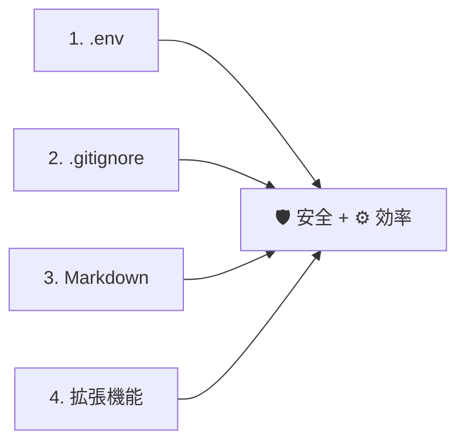
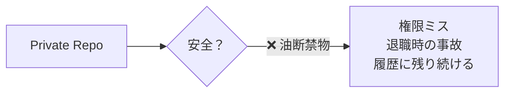
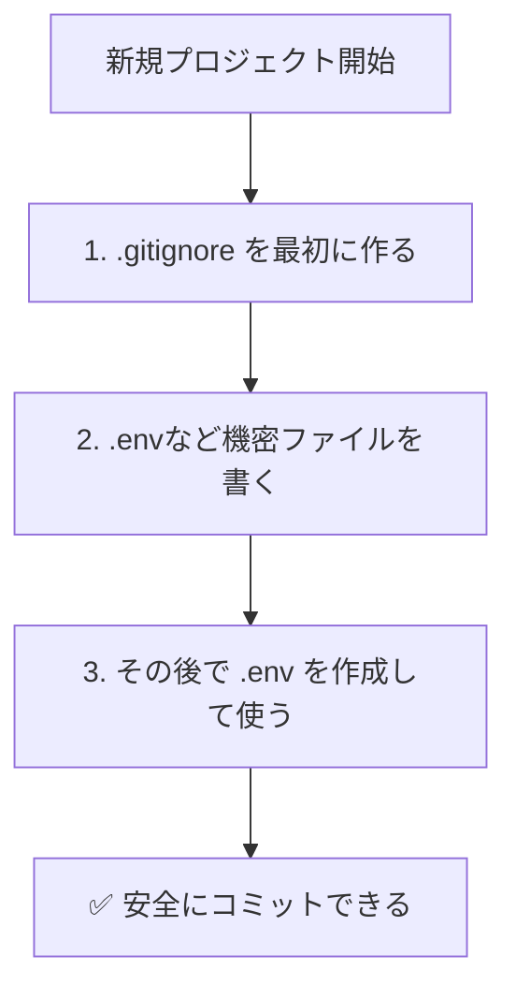
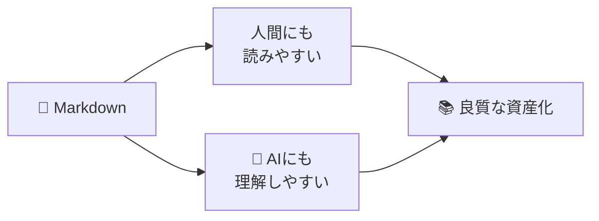
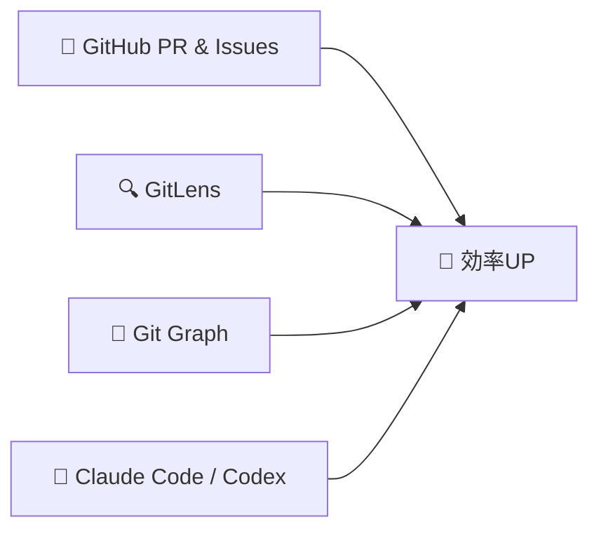

# 06: 応用（.env / .gitignore / Markdown / 拡張機能）

> 🎯 **この章でできるようになること**: 機密情報を漏洩から守り、見やすいREADMEを書き、便利な拡張機能を導入できる
> ⏱ **想定所要時間**: 15分
> 🔑 **前提知識**: [05章「戻す系操作」](./05-recovery.md) を完了していること

---

## 🎯 この章で扱う4テーマ



| テーマ | 役割 |
|--------|------|
| `.env` | 機密情報を **コードと分離** する箱 |
| `.gitignore` | GitHubに **送らないものリスト** |
| Markdown | 見やすい説明書を書くための **記法** |
| 拡張機能 | VSCodeを **Git管理画面に進化** させる |

---

## 1️⃣ `.env`：公開してはいけない秘密のメモ帳

[SCREENSHOT: 06-advanced-env-image.png - .envファイルのイメージ]

### こんな情報を入れる

| 入れるべき情報 | 理由 |
|---------------|------|
| APIキー | 漏れると課金や悪用される |
| データベースのパスワード | 不正アクセスされる |
| 認証トークン | アカウント乗っ取りリスク |
| 個人情報を含む設定値 | 法的リスク |

> ⚠ **これらをコード内に直接書くと、GitHubに公開した瞬間、世界中に晒されます。**
> Public リポジトリの場合、Bot が **数分以内に検知して悪用** することも珍しくありません。

### 使い方

プロジェクトのルート（一番上の階層）に `.env` というファイルを作成します。

```bash
# .env の中身（例）
API_KEY=sk-abcdef1234567890
DATABASE_PASSWORD=mySecret123
OPENAI_API_KEY=sk-...
```

| メリット | 内容 |
|----------|------|
| コードと設定の分離 | コード本体には書かない |
| 環境ごとの切替が楽 | 自分のPCとサーバーで違う値を持てる |

> 💡 `.env` は名前の通り「ドット始まり」の **隠しファイル** です。
> ファイル名の最初に `.` をつけて作成してください。

---

## 2️⃣ `.gitignore`：GitHubに送らないものリスト

[SCREENSHOT: 06-advanced-gitignore-image.png - .gitignoreファイルのイメージ]

### なぜ必要？

何でもかんでもGitHubに保存すればいい、というわけではありません。

| 送るべきでないもの | 理由 |
|---------------------|------|
| `.env` などの機密情報 | 漏洩リスク |
| `node_modules/` などの巨大なライブラリフォルダ | 容量がムダ |
| `.DS_Store`（Mac）/ `Thumbs.db`（Windows） | OSの一時ファイル |
| ログファイル `*.log` | ノイズが多い |
| エディタの個人設定 `.vscode/` | チームに不要 |

### 設定方法

リポジトリのルートに `.gitignore` というファイルを作り、無視したいファイル名やフォルダ名を **1行ずつ** 書きます。

```text
# 機密情報
.env
.env.local

# OS
.DS_Store
Thumbs.db

# ライブラリ
node_modules/

# ログ
*.log

# エディタ設定
.vscode/
```

> 💡 `.gitignore` はリポジトリのルートに置きます。
> サブフォルダごとに置くこともでき、その場合はそのフォルダ以下にだけ適用されます。

### VSCodeでの見え方

[SCREENSHOT: 06-advanced-gitignore-vscode.png - VSCode上の暗いファイル表示]

`.gitignore` に指定したファイルは:
- VSCodeのサイドバーで **色が暗くなる**
- Source Control の `Changes` 一覧に **表示されなくなる**

### 初心者あるある: `.env` を `.gitignore` に書き忘れて漏洩

> ⚠ **`.env` を `.gitignore` に書き忘れたままGitHub（Public）にプッシュ → 大事故**
> 公開したのが数秒だとしても、Botに収集されている可能性があります。
> APIキーは **必ずローテーション（再発行）** してください。

### Privateリポジトリでも油断禁物



> ⚠ Privateだからといって安心ではありません:
> - アクセス権限の設定ミス
> - チームメンバーの退職時の漏洩
> - **一度でもPushしてしまうと、ファイルを消してもGitの履歴に残り続ける**
>
> 万が一漏洩したら、APIキーの **再発行（ローテーション）** が必須です。
> 履歴を完全に消すには `BFG Repo-Cleaner` などの専用ツールが必要 ← **AIに頼みましょう**。

### 超重要: `.gitignore`は「未追跡ファイル」にのみ有効

> 🚨 **一度でもコミットしてしまったファイルは、後から `.gitignore` に追加しても追跡が止まりません。**
>
> たとえば、うっかり `.env` をコミットしたあとに `.gitignore` に追加しても、その `.env` は引き続きGitに追跡され続けます。
>
> その場合は以下のコマンドで追跡を解除する必要があります:
>
> ```bash
> git rm --cached .env
> ```
>
> ⚠ **ここだけまたコマンドが必要です、ごめんなさい。**
> ターミナルが苦手な方は、AIに **「`.env` を誤ってコミットしてしまったので追跡解除したい。手順を教えて」** と頼めば、操作までやってくれます。

### 安全フロー



> 💡 **黄金ルール: `.gitignore` を `.env` より先に作る。**

---

## 3️⃣ Markdown：きれいで読みやすい説明書を書く

READMEやGitHub上のコメント・Issue・PR説明は、**Markdown（マークダウン）** という記法で書くのがルールです。
HTMLを知らなくても、記号だけで見栄えを整えられます。

### よく使う基本記法

```markdown
# 見出し1（一番大きい）
## 見出し2
### 見出し3

- リスト項目1
- リスト項目2
  - ネストしたリスト

**太字**
*斜体*
`コード` ← プログラム名やパス
[リンクテキスト](https://example.com)

> 引用文

| 列1 | 列2 |
|-----|-----|
| A   | B   |
```

### よく使う「ボックス」

```markdown
> [!NOTE]
> 補足情報

> [!WARNING]
> 注意!

> [!TIP]
> ちょっとしたコツ
```

### コードブロック（言語指定推奨）

````markdown
```bash
git status
```

```python
print("Hello")
```
````

> 💡 **言語指定すると色付け（シンタックスハイライト）されて読みやすくなります。**
> `bash` `python` `javascript` `markdown` `yaml` などが代表的。

### VSCodeの便利機能

- ファイル拡張子を `.md` にする
- 画面右上の **プレビューボタン**（虫眼鏡付きアイコン）で実際の見た目を確認しながら編集
- `Ctrl + Shift + V` でも同じプレビューが開く

### なぜAI時代にMarkdownが重要か



| 理由 | 内容 |
|------|------|
| 人間と AI の **両方** にとって可読性が高い | プレーンテキストよりAIの理解力が上がる |
| AI生成物がほぼMarkdown | ChatGPT・Claudeの回答もMarkdownで返ってくる |
| GitHubが標準対応 | README・Issue・PRすべてMarkdown |

非エンジニアであっても、AIにドキュメントを読み込ませる時代の **基本素養** です。

---

## 4️⃣ 拡張機能：VSCodeを「Git管理画面」に進化させる

[SCREENSHOT: 06-advanced-extension-1.png - 拡張機能タブ]

### 入れておきたい3つ + AI



#### ■ GitHub Pull Requests and Issues

**GitHubのWebサイトを開く手間が省ける**

通常、PRを送るにはブラウザでGitHubを開く必要があります。
この拡張機能があれば、VSCode内から:
- PRを直接作成
- 他の人のコードにコメント
- Issueの一覧表示・作成

**「画面を行ったり来たり」が激減** します。

#### ■ GitLens — Git supercharged

**「これ書いたの誰？」がその場で解決**

コードの上にカーソルを置くだけで、うっすらと **「○ヶ月前にあなたが書きました（コミットメッセージ）」** が表示されます。

> 💡 数日前の自分はもはや他人です。
> 「なぜこの1行を書いたんだっけ？」が一瞬で分かります。

#### ■ Git Graph

**Gitの「流れ」が路線図のように見える**

[SCREENSHOT: 06-advanced-extension-gitgraph.png - Git Graph表示]

枝分かれしたブランチや合流（マージ）の様子が、**カラフルな路線図** のように表示されます。
- 「今、自分はどの枝にいるのか」
- 「どこで合流したのか」

> 💡 **05章のRevertでも使った拡張機能です。**
> コミット履歴を視覚的に把握できるので、操作ミスが激減します。

#### ■ Claude Code / Codex（拡張機能版）

[SCREENSHOT: 06-advanced-extension-claude-code.png - Claude Code拡張]
[SCREENSHOT: 06-advanced-extension-codex.png - Codex拡張]

ターミナル操作に慣れていない人は、GUIベースで操作できる **拡張機能版** がおすすめ。
チャット欄から指示を出すだけで、AIがファイル編集・コミット・Push までやってくれます。

### インストール手順

[SCREENSHOT: 06-advanced-extension-install.png - 拡張機能インストール]

1. 左メニューの **拡張機能** ボタン（四角形のアイコン）
2. 検索ボックスに名前を入力（例: `GitLens`）
3. 一番上の候補をクリック → **`Install`**

慣れてきたら、その他の拡張機能も色々試してみましょう。

---

## ✅ チェックリスト

- [ ] `.env` の役割と「コードに直接書かない理由」を説明できる
- [ ] `.gitignore` を作成し、最低限の項目（`.env` / `node_modules/` / `.DS_Store`）を書ける
- [ ] `.gitignore` は **未追跡ファイルにのみ有効** ということを理解した
- [ ] Markdownの基本記法（見出し・リスト・コード・表）を使える
- [ ] 拡張機能を3つ（GitHub PR & Issues / GitLens / Git Graph）入れた

---

## 💡 つまづきポイント

| よくあるミス | 対策 |
|--------------|------|
| `.env` を最初に作って `.gitignore` を後で書く | 順番を逆にする。`.gitignore` が先 |
| `.gitignore` を書いたのに `.env` がコミット候補に出る | 既に追跡されている。`git rm --cached .env` で解除（AIに相談） |
| Markdownのプレビューが出ない | 拡張子が `.md` になっているか確認。右上のプレビューボタンを押す |
| Public リポジトリにAPIキーをPushしてしまった | **即APIキーを再発行**。履歴削除は専用ツール（AIに相談） |
| 拡張機能が反映されない | VSCodeを再起動 |

---

## 🤖 AIへの質問テンプレ

```text
新しいプロジェクトを始めるので、汎用的な .gitignore のテンプレートが欲しいです。
言語: [ Python / Node.js / 何も使わない ]
エディタ: VSCode
OS: [ Windows / Mac ]
```

```text
誤って .env をコミット&プッシュしてしまいました。
GitHubのリポジトリは Private です。
1. 履歴から完全に削除する手順
2. APIキーを再発行すべきか
3. 今後同じミスを防ぐためのチェックリスト
を教えてください。
```

```text
このプロジェクトのREADME.mdを書いてください。
リポジトリ内のファイルを読み込んで、以下の構成で書いてください。
- 概要
- インストール
- 使い方
- ライセンス
出力はMarkdownで、表や見出しを活用してください。
```

```text
GitLensのおすすめ設定を、非エンジニア向けに教えてください。
通知が多すぎないように、最低限の便利機能だけONにしたいです。
```

---

## 🚀 次の章へ

最後は、AIサービスとの連携と「困ったときの聞き方」をまとめます。

[➡ 07章「AIサービス連携と困ったらAIに聞く」へ](./07-ai-integration.md)
