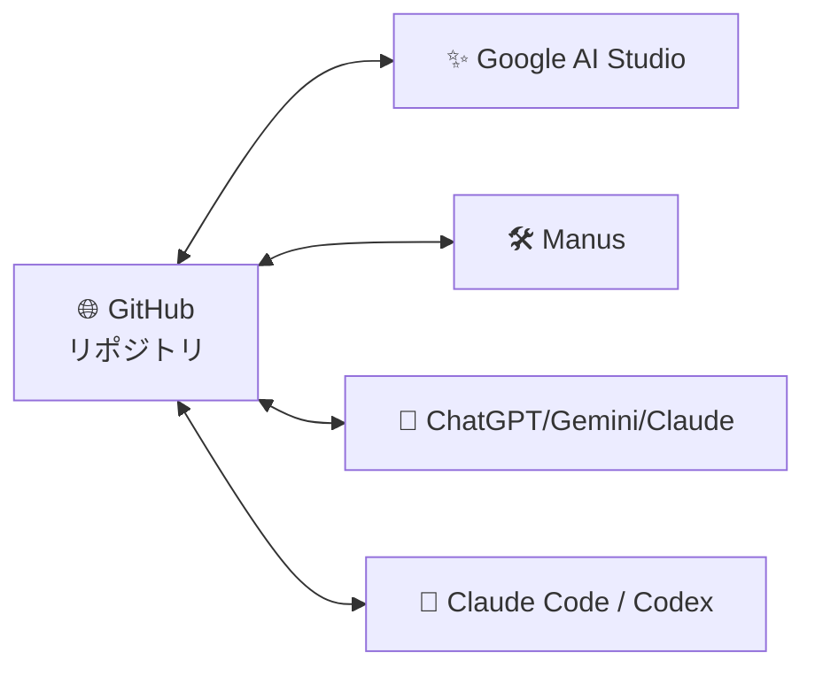
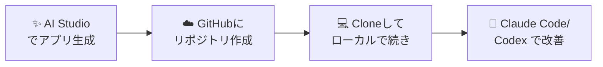
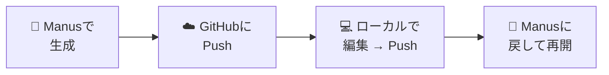
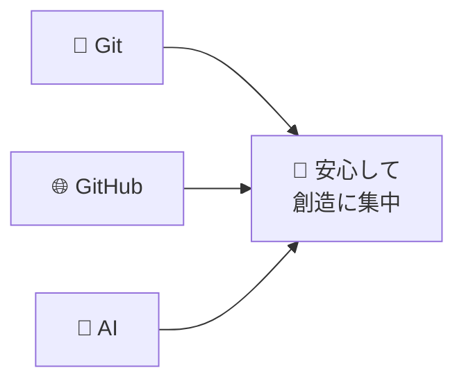

# 07: AIサービス連携 と「困ったらAIに聞く」

> 🎯 **この章でできるようになること**: AIサービスとGitHubを連携し、Git操作で詰まったら正しい質問でAIに解決してもらえる
> ⏱ **想定所要時間**: 10分
> 🔑 **前提知識**: [06章「応用」](./06-advanced.md) を完了していること

---

## 🤖 GitHubと連携できる主要AIサービス



GitHubを使えるようになっておくと、最近話題のAIサービスと連携してより便利にできます。
代表的な連携先を見ていきましょう。

---

## 1️⃣ Google AI Studio

[SCREENSHOT: 07-ai-google-ai-studio.png - Google AI Studio画面]

Google AI Studio では **無料で Gemini を使ってバイブコーディング** できます。

### 連携の流れ



| ステップ | 内容 |
|---------|------|
| ① | AI Studio上でサクッとアプリを作る |
| ② | そのままGitHubにリポジトリを作成 |
| ③ | GitHubからCloneして、ローカルで続きの作業 |
| ④ | Claude Code / Codex / Antigravity でさらに改善 |

> 💡 **「AIで雛形 → ローカルで仕上げ」** という分業ができます。

---

## 2️⃣ Manus

[SCREENSHOT: 07-ai-manus.png - Manus画面]

Manusも、バイブコーディングしたあとにGitHubと連携できるようになりました。

### Manusの面白いポイント



ローカルで編集してGitHubにプッシュしたあと、Manus側でその続きを再開することもできます。
**AIサービスとローカルを行き来できる** のが強みです。

---

## 3️⃣ ChatGPT / Gemini / Claude

[SCREENSHOT: 07-ai-chatgpt-github.png - ChatGPTとGitHub接続]

GitHubを接続することで、リポジトリの中身に対して直接質問できます。

| 使い方 | 例 |
|--------|----|
| コードの説明をしてもらう | 「このファイルが何をしているか教えて」 |
| ドキュメントを書いてもらう | 「このリポジトリのREADMEを作って」 |
| バグの相談 | 「この関数のバグを見つけて」 |

> 💡 **チャット型AIとローカルAIエージェント（Claude Code 等）を使い分けるのがコツ。**
> - チャット型: 「教えて系」「相談系」
> - ローカルAIエージェント: 「実際に作業させる系」

---

## 🚨 やらかしたときに使える「定型文」

Gitの操作でミスしたとき、慌てずに以下のテンプレに当てはめてAIに伝えれば、ほぼ解決できます。

### 万能テンプレ（これさえ覚えればOK）

```text
■ 状況
[ 今 何をしていて、どうなったか を3行以内で ]

■ やりたかったこと
[ 本来の目的 ]

■ エラーや表示
[ エラーメッセージや画面表示をそのまま貼る ]

■ 環境
- OS: [ Windows / Mac ]
- ツール: VSCode + Git
- リポジトリ: [ Public / Private ]
- 共同作業者: [ 1人 / チーム N人 ]

■ お願い
- VSCodeのGUI操作だけで完結する手順を教えてください
- 安全な選択肢から順に教えてください
```

### シーン別の短縮テンプレ

#### 🆘 「コミット前の編集を戻したい」

```text
ファイルを編集してまだコミットしていないのですが、
やっぱり全部最初の状態に戻したいです。
VSCodeで安全に戻す手順を教えてください。
```

#### 🆘 「コミットしたけど取り消したい（Push前）」

```text
さっきコミットしましたが、まだプッシュしていません。
このコミットだけをなかったことにして、
変更内容自体は手元に残したいです。手順を教えてください。
```

#### 🆘 「Pushしちゃったけどなかったことに」

```text
Push済みのコミットを取り消したいです。
チームで使っているリポジトリなので履歴は壊したくありません。
Revertで安全に対応したいので、Git Graphを使った手順を教えてください。
```

#### 🆘 「コンフリクトが出た」

```text
プルしたら以下のコンフリクトが出ました。
[ コンフリクトの中身をそのまま貼る ]
VSCodeのマージエディタで解決する手順を、
左右どちらの変更を採用すべきかの判断基準も含めて教えてください。
```

#### 🆘 「機密情報を誤ってPushした」

```text
.envファイル（APIキー入り）を誤ってGitHubにPushしてしまいました。
- リポジトリ: [ Public / Private ]
- Pushしてからの経過時間: [ 〇時間 ]
即やるべきこと（APIキー再発行など）と、
履歴から完全削除する手順を教えてください。
```

#### 🆘 「ブランチを切り替えられない」

```text
ブランチを切り替えようとすると
「未コミットの変更があります」と出て切り替えできません。
今の変更は捨てたくないです。
選択肢を全部洗い出して、それぞれのメリデメを教えてください。
```

#### 🆘 「detached HEAD になった」

```text
左下のブランチ名のところが「detached HEAD」と表示されています。
さっきリモートブランチ `origin/xxx` を選んでしまったのが原因かもしれません。
安全に脱出する手順を教えてください。コミットは失いたくないです。
```

---

## 🛠 Claude Codeでよく使う「Git関連の依頼プロンプト集10個」

Claude Code（または Codex）に直接お願いする際の、定番プロンプトです。

### 1. 変更内容に合うコミットメッセージを作って

```text
今ステージング中の変更を見て、
コミットメッセージを日本語で1行で提案してください。
動詞 + 何を変えたか の形式で。
```

### 2. 機密情報がコミット対象に入っていないか確認

```text
ステージング中のファイルをすべて確認し、
APIキー・パスワード・個人情報など
コミットすべきでない情報が含まれていないか確認してください。
あれば該当箇所と理由を教えてください。
```

### 3. ブランチ名を提案して

```text
これからやろうとしている作業: [ 内容 ]
適切なブランチ名を3つ提案してください。
- 英小文字 + ハイフン
- 30文字以内
- 動詞から始める
```

### 4. PR説明文を書いて

```text
このブランチのコミット履歴を読んで、
PR用のSummary / Test plan を Markdown で書いてください。
レビュアーが3分で読めるように。
```

### 5. リポジトリ全体を読んでREADMEを作って

```text
このリポジトリのファイルを全て読んで、
README.md を以下の構成で書いてください。
- 概要 / 用途
- セットアップ手順
- 使い方
- ディレクトリ構成
- ライセンス
非エンジニアでも理解できる平易な日本語で。
```

### 6. .gitignoreのテンプレを作って

```text
このリポジトリで使われている言語・ツールを判定し、
それに合った .gitignore を作成してください。
.env や OS の隠しファイルも忘れずに。
```

### 7. コミット履歴の要約

```text
直近10コミットを読んで、
「今週やったことのサマリー」を箇条書きで書いてください。
クライアントへの報告に使う想定で、専門用語は避けてください。
```

### 8. 戻したいコミットをRevertして

```text
コミット [ コミットハッシュまたは "○○の変更を加えたコミット" ]
をRevertしてください。
作業前にどんな影響があるかを先に教えてください。
問題なければそのまま実行をお願いします。
```

### 9. コンフリクトを解消して

```text
今プルしたらコンフリクトが発生しました。
ファイル一覧と各コンフリクトを確認し、
どちらの変更を採用すべきかの判断材料を提示してください。
私の判断後、解消とコミットまでお願いします。
```

### 10. 一連の作業を一気に

```text
以下を順番にお願いします。
1. 現在の変更をすべてステージング
2. 変更内容に合うコミットメッセージを作成
3. コミット
4. リモートにプッシュ
5. PR作成（タイトル・本文も生成）
途中で確認が必要な場合は止めてください。
```

---

## 🔌 VSCode拡張機能 まとめ（Claude Code / Codex）

[SCREENSHOT: 07-ai-claude-code-extension.png - Claude Code拡張機能]
[SCREENSHOT: 07-ai-codex-extension.png - Codex拡張機能]

ターミナルが苦手な方は、**拡張機能版** が断然おすすめです。

| 拡張機能 | 特徴 |
|----------|------|
| **Claude Code** | チャット欄から指示するだけでファイル編集・Git操作まで完了 |
| **Codex** | ChatGPT契約があれば追加費用なし。Claude Codeと並ぶ強力さ |

導入のメリット:
- VSCodeを離れずにすべて完結
- 複雑なGit操作も「お願い」一言で実行
- エラーが出たら自動で修正案を提案

> 💡 **使い分けのコツ**
> - 単純なお願い（「コミットして」「Pushして」）→ どちらでもOK
> - 複雑な調査や設計 → Claude Code
> - ChatGPTでの会話資産を活かしたい → Codex

---

## 📝 困ったとき、AIに **何を伝えるか** だけ覚える


| 伝える項目 | 内容 |
|-----------|------|
| **状況** | 今何をしていて、どうなったか |
| **目的** | 本来やりたかったこと |
| **エラー** | エラーメッセージ・画面表示をそのまま |
| **環境** | OS・ツール・Public/Private・共同作業者数 |

これだけ揃えれば、AIは **ほぼ確実に正解にたどり着けます**。

---

## 🌟 最後に: 「困ったら全部AIに聞く」

このガイドでは、最低限覚えておくと便利な操作に絞って紹介しました。
コマンドもほぼ使わずにGit/GitHubを使えるように説明しましたが、それでもかなりの情報量だったと思います。

### 大事なのは2つだけ

1. **最初は「コミット → プッシュ」だけで十分**
   プルリク・マージ・Issue・Revertは覚えなくてもOK
   最悪、AIにそこら辺の操作はお願いすればやってくれます

2. **困ったらAIに聞く**
   ChatGPT / Gemini に聞くのも良いですが、**VSCode内のAIエージェント** に聞くと作業まで代行してくれます
   AIはGit/GitHubの操作が **超得意** です

### このガイドで触れなかった話題（必要になったらAIに）

- GitHub Actions（自動化ワークフロー）
- SSH認証の設定
- stash（一時退避）
- rebase / cherry-pick
- force push の安全な使い方
- BFG Repo-Cleaner（履歴の完全削除）

> 💡 **どれもAIに聞けば、あなたの状況に合った手順を教えてくれます。**

---

## 🎓 卒業チェック（このガイド全体）

ここまで読み終えたあなたは、以下ができるようになっているはずです。

- [ ] Git/GitHubがなぜAI時代に必要かを説明できる
- [ ] 主要用語10個を図で説明できる
- [ ] VSCode + Git + GitHub の環境構築ができる
- [ ] 自分のリポジトリをGitHubにPublishできる
- [ ] Push / Branch / PR / Merge の日常フローができる
- [ ] Discard / Undo / Revert を使い分けられる
- [ ] `.gitignore` で機密情報を守れる
- [ ] Markdownで読みやすい説明書を書ける
- [ ] 困ったらAIに正しく質問できる

---

## ✅ チェックリスト（07章）

- [ ] AIサービス（Google AI Studio / Manus / ChatGPT等）とGitHubの連携イメージを掴んだ
- [ ] 「やらかし時の定型文テンプレ」を保存した
- [ ] Claude Code用のGitプロンプト集を保存した
- [ ] Claude Code または Codex の拡張機能をVSCodeに入れた

---

## 💡 つまづきポイント

| よくある状況 | 対応 |
|--------------|------|
| AIに聞いても解決しない | テンプレに沿って状況・目的・エラー・環境を全部書いて再質問 |
| AIが間違った操作を提案した | 「その操作のリスクは？」と聞き返す |
| Claude Codeが動かない | 拡張機能の認証を再実行。VSCodeを再起動 |
| AIがコマンドを使ってくる | 「VSCodeのGUI操作だけで」と明示する |

---

## 🤖 AIへの質問テンプレ（最後の総合版）

```text
私はGit/GitHub初心者の非エンジニアです。
業務は[ 営業 / マーケ / 企画 ]で、
[ 提案書 / プロンプト / Excel自動化 ]をリポジトリで管理しています。

これから取り組みたい作業: [ 内容 ]

VSCodeのGUI操作だけで完結する手順を、
コマンドが必要な箇所はその理由と共に教えてください。
リスクの高い操作は事前に警告してください。
```

---

## 🎉 おめでとうございます！

> Git/GitHubはこれからのAI時代、本当に必須です。使わない選択肢はありません。

**是非Git/GitHubを活用して、AIに翻弄されない快適なバイブコーディングライフを！**



---

## 🔄 最初に戻る

[🏠 README.md（目次）に戻る](./README.md)
