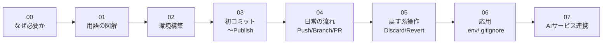

# AI時代に超必須！VSCode × Git × GitHub入門

> **AIにファイルをぐちゃぐちゃにされる恐怖から解放される、図解多めの入門ガイド。**
> 難しいコマンドはほぼ使いません。マウス操作だけで完結します。

---

## 🎯 このガイドのゴール

- 「AIに任せたら元に戻せなくなった…」を二度と起こさない仕組みを作る
- VSCode上のボタン操作だけで、Git / GitHub を扱えるようになる
- 詰まったときに **AIへ正しく質問できる** ようになる

---

## 👤 想定読者

- 営業・マーケ・企画・士業・経営者など **非エンジニア** の方
- Claude Code / Cursor / Antigravity で **バイブコーディング** を始めた/始めたい方
- AIに編集させてファイルが壊れた経験がある方
- 黒い画面（コマンド）が苦手な方

---

## 🗺 全体マップ（このガイドの流れ）

> 上から順に読むと、知識→環境→実践→応用 の順で無理なく身につきます。

---

## 📚 章一覧

| 章 | タイトル | 目安時間 | 内容 |
|----|----------|----------|------|
| [00](./00-intro.md) | なぜGit/GitHubが必要か | 5分 | バイブコーディング時代の動機付け |
| [01](./01-concepts.md) | 基本用語の図解解説 | 15分 | リポジトリ・コミット・プッシュ等 |
| [02](./02-setup.md) | 環境構築 | 20分 | VSCode / Git / GitHubアカウント |
| [03](./03-first-commit.md) | 初コミット〜Publish | 15分 | はじめてのリポジトリ公開 |
| [04](./04-daily-workflow.md) | 日常操作 | 25分 | Push / Branch / PR / Merge |
| [05](./05-recovery.md) | 戻す系操作 | 15分 | Discard / Revert / Undo |
| [06](./06-advanced.md) | 応用 | 15分 | .env / .gitignore / Markdown / 拡張機能 |
| [07](./07-ai-integration.md) | AIサービス連携 | 10分 | Google AI Studio・Manus・Claude Code 等 |

---

## 📖 読み方ガイド

### はじめての方
**01 → 02 → 03** の順で読むのがおすすめです。
ここまで進めば、自分のリポジトリ（プロジェクトの保管場所）を1つGitHubに公開できます。

### バイブコーディングをすぐに始めたい方
最低限 **02 → 03** を実践してから AI に作業を任せましょう。
これだけで「AIにぐちゃぐちゃにされても元に戻せる」状態になります。

### 詰まった方
**07章のAIへの質問テンプレ** を見れば、ほとんどのトラブルは AI に聞いて解決できます。

---

## 🔑 全章で共通のお約束

各章には以下が必ず含まれています。

- 🎯 **この章でできるようになること**（1行）
- ⏱ **想定所要時間**
- 🔑 **前提知識**（前章へのリンク）
- ✅ **チェックリスト**（習得すべき項目）
- 💡 **つまづきポイント**
- 🤖 **AIへの質問テンプレ**

---

## 📊 主要図解（再利用可能）

各章のなかで何度も参照される基本図は、独立ファイルにまとめてあります。

| 図 | 用途 | 単独ファイル |
|----|------|--------------|
| Git/GitHub 全体像 | ローカル⇔リモートの関係 | [`assets/diagrams/git-github-overview.md`](./assets/diagrams/git-github-overview.md) |
| ライフサイクル | 編集→コミット→プッシュ→マージ | [`assets/diagrams/lifecycle.md`](./assets/diagrams/lifecycle.md) |
| ファイルの状態遷移 | Untracked→Staged→Committed→Pushed | [`assets/diagrams/file-state-transition.md`](./assets/diagrams/file-state-transition.md) |

---

## 🛠 用意するもの

| 項目 | 必須/推奨 | 備考 |
|------|-----------|------|
| VSCode | 必須 | 無料。Cursor / Antigravity でも代用可 |
| Git | 必須 | 無料。インストールするだけ |
| GitHubアカウント | 必須 | 無料。Googleアカウントでも作成可 |
| AIエージェント | 推奨 | Claude Code / Codex などがあると詰まりにくい |

---

## 💬 トーンとメタファー

このガイドでは、用語をできるだけ身近なものに置き換えて説明します。

- **Git** ＝ 保存するたびにページが増える「ノート」、または「タイムマシン」
- **GitHub** ＝ そのノートを共有できる「クラウド拠点」
- **コミット** ＝ ゲームのセーブポイント
- **ブランチ** ＝ 同じ箱の中の「別レーン（別案の作業場所）」
- **プルリクエスト** ＝ 公開前の「確認お願いします」依頼書
- **マージ** ＝ 確認済みの内容を本番に取り込む

---

## 🚀 はじめましょう

[➡ 00章「なぜGit/GitHubが必要か」を読む](./00-intro.md)
