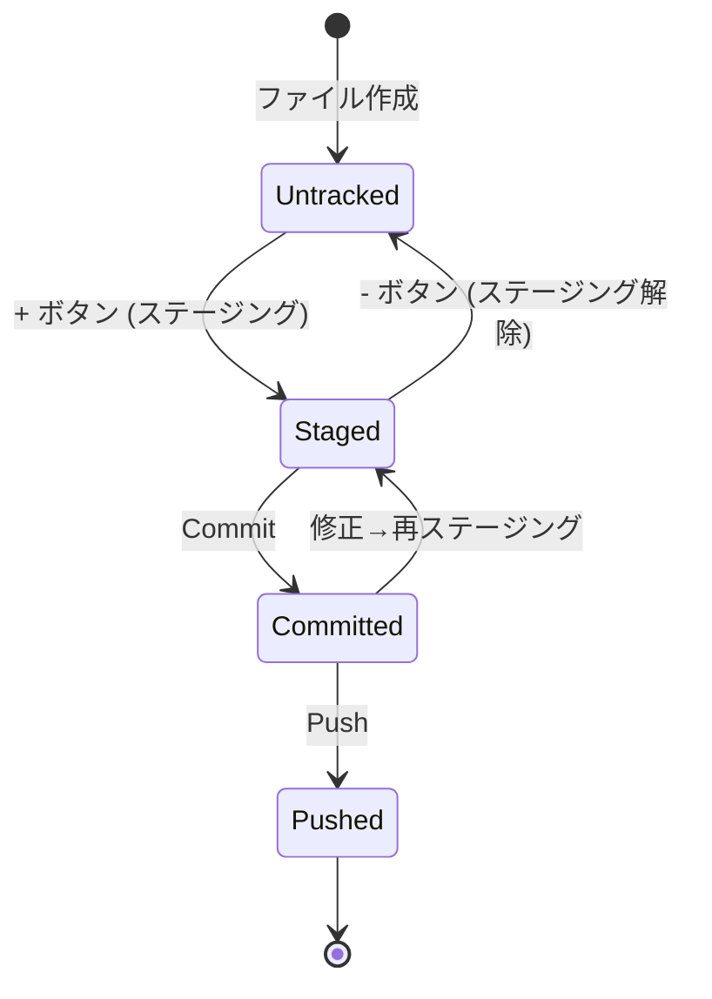

# ファイルの状態遷移

| 状態 | VSCodeでの見え方 |
|------|------------------|
| Untracked（追跡外） | Source Control の「Changes」に表示 |
| Staged（ステージ済） | 「Staged Changes」に表示 |
| Committed（セーブ済） | Graph に履歴として表示（ローカルのみ） |
| Pushed（共有済） | Graph に `origin/` 付きで表示 |
