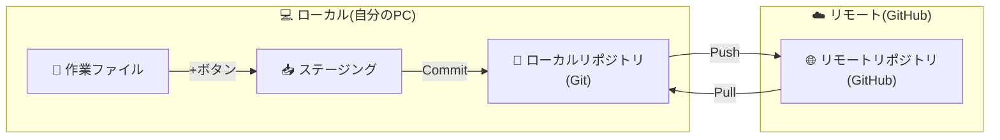

# 全体像: ローカル(Git) ⇔ リモート(GitHub)

```mermaid
flowchart LR
    subgraph Local["💻 ローカル(自分のPC)"]
        Work["📝 作業ファイル"]
        Stage["📥 ステージング"]
        Repo["📓 ローカルリポジトリ<br/>(Git)"]
    end
    subgraph Remote["☁️ リモート(GitHub)"]
        GHRepo["🌐 リモートリポジトリ<br/>(GitHub)"]
    end

    Work -->|"+ボタン"| Stage
    Stage -->|"Commit"| Repo
    Repo -->|"Push"| GHRepo
    GHRepo -->|"Pull"| Repo
```

| 操作 | 何をする？ |
|------|------------|
| ステージング | 「次のセーブに含めるファイル」を選ぶ |
| コミット | ローカルのノートに「セーブ」する |
| プッシュ | ローカルの内容をGitHubに送る |
| プル | GitHubの最新を自分のPCに取り込む |
