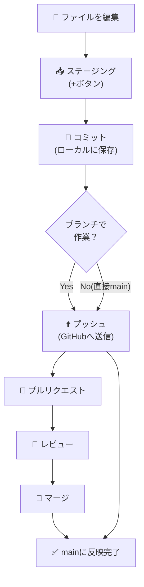

# ライフサイクル: コミット → プッシュ → マージ

```mermaid
flowchart TD
    Start["📝 ファイルを編集"]
    Stage["📥 ステージング<br/>(+ボタン)"]
    Commit["💾 コミット<br/>(ローカルに保存)"]
    Branch{"ブランチで<br/>作業？"}
    Push["⬆️ プッシュ<br/>(GitHubへ送信)"]
    PR["📨 プルリクエスト"]
    Review["👀 レビュー"]
    Merge["🔀 マージ"]
    Done["✅ mainに反映完了"]

    Start --> Stage
    Stage --> Commit
    Commit --> Branch
    Branch -- "Yes" --> Push --> PR --> Review --> Merge --> Done
    Branch -- "No(直接main)" --> Push --> Done
```

> 💡 個人開発なら最低限「コミット → プッシュ」だけで十分です。
> チームで使うときに「ブランチ → プルリクエスト → マージ」が活きてきます。
